# DISCRECONTINUAL_EQUATIONS

## Overview

The `discrecontinual_equations` library provides a comprehensive, production-ready framework for solving differential equations using advanced numerical methods. It supports both ordinary differential equations (ODEs) and stochastic differential equations (SDEs) with full calculus interpretation support, offering researchers and engineers a complete toolkit for scientific computing and mathematical modeling.

## Architecture

The library is organized into hierarchical modules providing complete functionality:

- **[FUNCTION](function/FUNCTION.md)**: Function definitions with calculus support
- **[SOLVER](solver/SOLVER.md)**: 13 numerical algorithms (7 ODE + 6 SDE solvers)
- **[PLOT](plot/PLOT.md)**: 4 visualization classes for analysis

## Executive Summary

**Purpose**: Complete differential equation solving toolkit for scientific computing
**Key Features**: 13 numerical solvers, calculus interpretation support, advanced visualization
**Performance**: Production-ready with comprehensive error control and reproducibility
**Use Cases**: Research, engineering, financial modeling, physics simulations

## Capabilities Overview

### 🔢 **Deterministic Solvers (7 methods)**
- **Euler**: Basic 1st-order method
- **Adams-Bashforth 2/3**: Linear multistep methods
- **Cash-Karp**: Embedded 4th/5th-order Runge-Kutta
- **Fehlberg**: Alternative 4th/5th-order Runge-Kutta
- **Dormand-Prince**: Industry-standard 5th/4th-order method
- **Dormand-Prince 89**: High-precision 8th/9th-order method

### 🎲 **Stochastic Solvers (6 methods)**
- **Euler-Maruyama**: Fundamental SDE method (strong order 0.5)
- **Milstein**: Higher-order with diffusion correction (strong order 1.0)
- **SRK2-5**: Stochastic Runge-Kutta family (orders 1.0 to 2.5)

### 📊 **Calculus Support**
- **Ito Calculus**: Standard interpretation for SDEs
- **Stratonovich Calculus**: Alternative with automatic conversion
- **Automatic Conversion**: Seamless switching between interpretations

### 📈 **Visualization (4 classes)**
- **LinePlot**: Time series and general 2D/3D plotting
- **PhasePlot**: 2D phase space analysis
- **DelayPlot**: Delay embeddings and attractor reconstruction
- **SpectrumPlot**: Power spectra and frequency analysis

## Detailed Architecture

```mermaid
classDiagram
    %% Core Components
    class DifferentialEquation {
        +variables: list[Variable]
        +parameters: list[Parameter]
        +derivative: Function
        +time: Variable
    }

    class Variable {
        +discretization: list[float]
        +name: str
        +abbreviation: str
    }

    class Parameter {
        +value: float
        +name: str
        +abbreviation: str
    }

    class Curve {
        +variables: list[Variable]
        +results: list[Variable]
        +time: Variable
        +append(values)
    }

    %% Function Hierarchy
    class Function {
        <<abstract>>
        +eval(point, time)*: list[float]
        +diffusion(point, time)*: list[float]
    }

    class DeterministicFunction {
        +eval(point, time): list[float]
    }

    class StochasticFunction {
        +eval(point, time): list[float]
        +diffusion(point, time): list[float]
    }

    %% Complete Solver Hierarchy
    class Solver {
        <<abstract>>
        +solve(equation, initial_values)*
    }

    %% Deterministic Solvers
    class EulerSolver {
        +solve(equation, initial_values)
    }

    class AdamsBashforth2Solver {
        +solve(equation, initial_values)
    }

    class AdamsBashforth3Solver {
        +solve(equation, initial_values)
    }

    class CashKarpSolver {
        +solve(equation, initial_values)
    }

    class FehlbergSolver {
        +solve(equation, initial_values)
    }

    class DormandPrinceSolver {
        +solve(equation, initial_values)
    }

    class DormandPrince89Solver {
        +solve(equation, initial_values)
    }

    %% Stochastic Solvers
    class EulerMaruyamaSolver {
        +solve(equation, initial_values)
    }

    class MilsteinSolver {
        +solve(equation, initial_values)
    }

    class SRK2Solver {
        +solve(equation, initial_values)
    }

    class SRK3Solver {
        +solve(equation, initial_values)
    }

    class SRK4Solver {
        +solve(equation, initial_values)
    }

    class SRK5Solver {
        +solve(equation, initial_values)
    }

    %% Plot Classes
    class LinePlot {
        +plot_curves(curve, title)
        +plot(x, y, title)
        +plot_3d(x, y, z, title)
    }

    class PhasePlot {
        +plot(x, y, title)
    }

    class DelayPlot {
        +plot(x, delay, title)
        +plot_3d(x, delay1, delay2, title)
    }

    class SpectrumPlot {
        +plot_fft(x, dt, title)
        +plot_periodogram(x, dt, title)
    }

    %% Relationships
    DifferentialEquation --> Function
    DifferentialEquation --> Variable
    DifferentialEquation --> Parameter
    Function --> Variable
    Function --> Parameter
    Solver --> DifferentialEquation
    Solver --> Curve
    LinePlot --> Curve
    PhasePlot --> Curve
    DelayPlot --> Curve
    SpectrumPlot --> Curve

    Function <|-- DeterministicFunction
    Function <|-- StochasticFunction

    Solver <|-- EulerSolver
    Solver <|-- AdamsBashforth2Solver
    Solver <|-- CashKarpSolver
    Solver <|-- DormandPrinceSolver
    Solver <|-- EulerMaruyamaSolver
    Solver <|-- MilsteinSolver
    Solver <|-- SRK2Solver
```



## Core Concepts

### Differential Equations

The library supports two main types of differential equations:

1. **Ordinary Differential Equations (ODEs)**:
   ```
   dy/dt = f(t, y)
   ```

2. **Stochastic Differential Equations (SDEs)**:
   ```
   dX_t = μ(X_t, t) dt + σ(X_t, t) dW_t
   ```

### Numerical Methods

The library implements various numerical methods:

- **Fixed-step methods**: Euler, Adams-Bashforth (2nd, 3rd order)
- **Adaptive methods**: Runge-Kutta variants (Cash-Karp, Fehlberg, Dormand-Prince)
- **Stochastic methods**: Euler-Maruyama for SDEs

## Sequence Diagrams

### ODE Solving Workflow


### SDE Solving Workflow


### Adaptive Solving with Error Control

```mermaid
sequenceDiagram
    participant User
    participant AdaptiveSolver
    participant Function
    participant Curve

    User->>AdaptiveSolver: solve(equation, initial_values)

    loop Integration loop
        AdaptiveSolver->>AdaptiveSolver: Check if at end time
        break end_time reached

        AdaptiveSolver->>Function: eval(current_state, time)
        AdaptiveSolver->>AdaptiveSolver: Take trial step with current h

        alt Step accepted
            AdaptiveSolver->>Curve: append(accepted_state)
            AdaptiveSolver->>AdaptiveSolver: Compute optimal h for next step
        else Step rejected
            AdaptiveSolver->>AdaptiveSolver: Reduce step size
            AdaptiveSolver->>AdaptiveSolver: Retry step
        end
    end

    AdaptiveSolver-->>User: Return adaptively sampled solution
```

### Plotting Workflow


## Quick Start

```python
from discrecontinual_equations import DifferentialEquation, Variable, Parameter
from discrecontinual_equations.function import DeterministicFunction
from discrecontinual_equations.solver.euler import EulerConfig, EulerSolver

# Define variables and parameters
x = Variable(name="Position", abbreviation="x")
t = Variable(name="Time", abbreviation="t")
k = Parameter(name="Spring constant", value=1.0)

# Define the ODE: dx/dt = -k*x (harmonic oscillator)
class HarmonicOscillator(DeterministicFunction):
    def eval(self, point, time=None):
        x_val = point[0]
        return [-self.parameters[0].value * x_val]

# Create the differential equation
oscillator = HarmonicOscillator(variables=[x], parameters=[k])
equation = DifferentialEquation(
    variables=[x],
    time=t,
    parameters=[k],
    derivative=oscillator
)

# Solve using Euler method
config = EulerConfig(start_time=0, end_time=10, step_size=0.01)
solver = EulerSolver(config)
solver.solve(equation, [1.0])  # Initial condition x=1

# Access results
print(f"Final position: {solver.solution.results[0].discretization[-1]}")
```

## Key Features

- **Modular Design**: Clean separation of concerns with well-defined interfaces
- **Type Safety**: Full type annotations and Pydantic validation
- **Extensible**: Easy to add new solvers and equation types
- **Well-Documented**: Comprehensive docstrings and academic references
- **Tested**: High test coverage with automated testing

## Installation

```bash
pip install discrecontinual_equations
```

## Dependencies

- Python 3.8+
- NumPy
- Pydantic
- Plotly (for visualization)

## License

This library is released under the MIT License.

## Contributing

See [CONTRIBUTING.md](CONTRIBUTING.md) for development guidelines.

## Algorithm Sources

The library implements numerical algorithms based on original research papers and established literature:

### Primary Algorithm Sources
- **Euler Method**: Classical forward difference approximation (Leonhard Euler, 1768)
- **Adams-Bashforth**: Adams (1855), Bashforth (1883) - Original linear multistep formulations
- **Cash-Karp (4,5)**: Cash, J.R. and Karp, A.H. (1978) - ACM Transactions on Mathematical Software
- **Fehlberg (4,5)**: Fehlberg, Erwin (1968) - NASA Technical Report R-287
- **Dormand-Prince (5,4)**: Dormand, J.R. and Prince, P.J. (1980) - Journal of Computational and Applied Mathematics
- **Dormand-Prince (8,9)**: Dormand, J.R. and Prince, P.J. (1987) - Computational Mathematics with Applications
- **Euler-Maruyama**: Maruyama, Gisiro (1955) - Rendiconti del Circolo Matematico di Palermo

### Reference Books
- **Hairer, E., et al.** (1993). Solving Ordinary Differential Equations I: Nonstiff Problems
- **Kloeden, P. E. & Platen, E.** (1992). Numerical Solution of Stochastic Differential Equations

---

**Submodules:**
- [FUNCTION](FUNCTION.md) - Function definitions and equation types
- [SOLVER](SOLVER.md) - Numerical algorithms and solvers
- [PLOT](PLOT.md) - Visualization utilities
