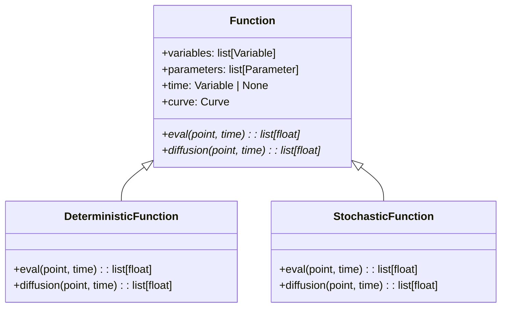

# FUNCTION

## Overview

The `function` submodule provides the abstract base classes and concrete implementations for defining differential equation functions. It establishes a clean hierarchy for both deterministic and stochastic differential equations.

## Architecture

```
Function (Abstract Base)
├── DeterministicFunction (ODEs)
└── StochasticFunction (SDEs)
```

## Class Hierarchy

### Function (Abstract Base Class)

```python
class Function:
    """Base class for differential equation functions."""

    @property
    def variables(self) -> list[Variable]: ...
    @property
    def parameters(self) -> list[Parameter]: ...
    @property
    def time(self) -> Variable | None: ...

    def eval(self, point: list[float], time: float | None = None) -> list[float]:
        """Evaluate the function at a given point and time."""
        raise NotImplementedError()

    def diffusion(self, point: list[float], time: float | None = None) -> list[float]:
        """Evaluate diffusion term for SDEs."""
        raise NotImplementedError()
```

### DeterministicFunction

```python
class DeterministicFunction(Function):
    """Function class for ordinary differential equations (deterministic)."""

    def eval(self, point: list[float], time: float | None = None) -> list[float]:
        """Evaluate the derivative for ODEs."""
        raise NotImplementedError()

    def diffusion(self, point: list[float], time: float | None = None) -> list[float]:
        """Deterministic functions have zero diffusion."""
        return [0.0] * len(point)
```

### StochasticFunction

```python
class StochasticFunction(Function):
    """Function class for stochastic differential equations."""

    def eval(self, point: list[float], time: float | None = None) -> list[float]:
        """Evaluate the drift term μ(x, t) for SDEs."""
        raise NotImplementedError()

    def diffusion(self, point: list[float], time: float | None = None) -> list[float]:
        """Evaluate the diffusion term σ(x, t) for SDEs."""
        raise NotImplementedError()
```

## UML Design



## Usage Examples

### Ordinary Differential Equations

```python
from discrecontinual_equations.function import DeterministicFunction
from discrecontinual_equations import Variable, Parameter

class ExponentialDecay(DeterministicFunction):
    """ODE: dx/dt = -k*x"""

    def eval(self, point: list[float], time: float | None = None) -> list[float]:
        x = point[0]  # Current value
        k = self.parameters[0].value  # Decay constant
        return [-k * x]  # Derivative

# Usage
x = Variable(name="Concentration", abbreviation="x")
k = Parameter(name="Rate constant", value=0.1)

decay = ExponentialDecay(variables=[x], parameters=[k])
result = decay.eval([1.0])  # Returns [-0.1] for x=1, k=0.1
```

### Stochastic Differential Equations

```python
from discrecontinual_equations.function import StochasticFunction
from discrecontinual_equations import Variable, Parameter

class OrnsteinUhlenbeck(StochasticFunction):
    """SDE: dX = -αX dt + σ dW (mean-reverting process)"""

    def eval(self, point: list[float], time: float | None = None) -> list[float]:
        """Drift term: μ(x,t) = -αx"""
        x = point[0]
        alpha = self.parameters[0].value  # Mean reversion rate
        return [-alpha * x]

    def diffusion(self, point: list[float], time: float | None = None) -> list[float]:
        """Diffusion term: σ(x,t) = σ"""
        sigma = self.parameters[1].value  # Volatility
        return [sigma]

# Usage
x = Variable(name="Position", abbreviation="x")
alpha = Parameter(name="Mean reversion", value=1.0)
sigma = Parameter(name="Volatility", value=0.5)

ou_process = OrnsteinUhlenbeck(variables=[x], parameters=[alpha, sigma])
drift = ou_process.eval([2.0])        # Returns [-2.0]
diffusion = ou_process.diffusion([2.0])  # Returns [0.5]
```

## Calculus Support for SDEs

Stochastic functions support both Ito and Stratonovich calculus interpretations:

**Ito Calculus**: Standard interpretation `dX = μ(X,t)dt + σ(X,t)dW`
- Used in mathematical finance and stochastic analysis
- Corresponds to limit of discrete approximations

**Stratonovich Calculus**: Symmetric interpretation `dX = μ(X,t)dt + σ(X,t) ∘ dW`
- Natural for physical systems
- Equivalent to Ito with drift correction: `μ_corrected = μ - (1/2)σ∂σ/∂x`

Solvers automatically handle calculus conversion when requested.

## Key Features

- **Type Safety**: Clear distinction between deterministic and stochastic functions
- **Calculus Support**: Full Ito/Stratonovich calculus for SDEs
- **Extensible**: Easy to implement custom ODE/SDE functions
- **Validated**: Pydantic models ensure correct parameter types
- **Documented**: Comprehensive docstrings with usage examples

## Integration with Solvers

Functions are used by solvers to compute derivatives at each integration step:

```python
# Solver workflow
for time_step in config.times:
    # Evaluate derivative
    derivative_values = equation.derivative.eval(current_state, time_step)

    # For SDEs, also evaluate diffusion
    if isinstance(equation.derivative, StochasticFunction):
        diffusion_values = equation.derivative.diffusion(current_state, time_step)

    # Update state using numerical method
    # ...
```

## Error Handling

Functions should validate their inputs and raise appropriate exceptions:

```python
def eval(self, point: list[float], time: float | None = None) -> list[float]:
    if len(point) != len(self.variables):
        raise ValueError(f"Expected {len(self.variables)} values, got {len(point)}")

    # Function evaluation logic...
```

## Performance Considerations

- Functions are called repeatedly during integration
- Keep evaluations efficient for long simulations
- Cache expensive computations when possible
- Use vectorized operations for multiple variables

---

**Parent Module:** [DISCRECONTINUAL_EQUATIONS](../DISCRECONTINUAL_EQUATIONS.md)

**Related Modules:**
- [SOLVER](../SOLVER.md) - Uses functions for derivative evaluation
