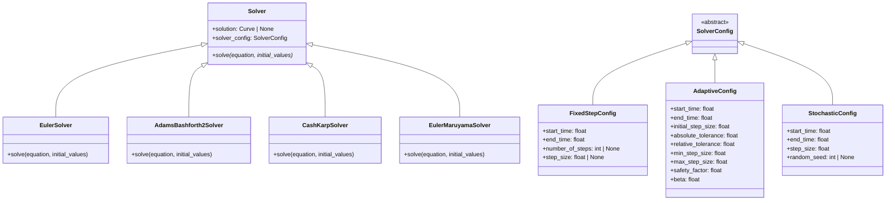

# SOLVER

## Overview

The `solver` submodule provides a comprehensive collection of numerical algorithms for solving differential equations, organized into deterministic and stochastic categories. It implements both fixed-step and adaptive-step methods with full support for calculus interpretation in stochastic systems.

## Architecture

The solver hierarchy is organized by equation type and numerical method:

```
Solver (Abstract Base)
├── Deterministic Solvers
│   ├── EulerSolver
│   ├── AdamsBashforth2Solver
│   ├── AdamsBashforth3Solver
│   ├── CashKarpSolver
│   ├── FehlbergSolver
│   ├── DormandPrinceSolver
│   └── DormandPrince89Solver
└── Stochastic Solvers
    ├── EulerMaruyamaSolver
    ├── MilsteinSolver
    ├── SRK2Solver
    ├── SRK3Solver
    ├── SRK4Solver
    └── SRK5Solver
```

## Core Classes

### Solver (Abstract Base Class)

```python
class Solver:
    """Abstract base class for numerical differential equation solvers."""

    solution: Curve | None = None

    def __init__(self, solver_config: SolverConfig):
        """Initialize with solver configuration."""

    @property
    def solver_config(self) -> SolverConfig:
        """Get solver configuration."""

    def solve(self, equation: DifferentialEquation, initial_values: list[float]):
        """Solve the differential equation."""
        raise NotImplementedError()
```

### SolverConfig (Abstract Base Class)

```python
class SolverConfig(BaseModel):
    """Abstract base class for solver configuration objects."""
    pass
```

## Deterministic Solvers (ODEs)

### Fixed-Step Methods

#### Euler Method
- **Order**: 1st order, O(h)
- **Stability**: Conditionally stable
- **Usage**: Simple problems, educational purposes, baseline comparisons
- **Formula**: `y_{n+1} = y_n + h f(t_n, y_n)`
- **Reference**: Leonhard Euler (1768)

#### Adams-Bashforth Methods
- **Adams-Bashforth 2**: 2nd order, requires 1 previous step
  - Formula: `y_{n+1} = y_n + h/2 * (3f_n - f_{n-1})`
- **Adams-Bashforth 3**: 3rd order, requires 2 previous steps
  - Formula: `y_{n+1} = y_n + h/12 * (23f_n - 16f_{n-1} + 5f_{n-2})`
- **Reference**: Adams (1855), Bashforth (1883)

### Adaptive Methods (Embedded Runge-Kutta)

#### Cash-Karp (4,5)
- **Embedded Pair**: 4th/5th order Runge-Kutta
- **Stages**: 6 function evaluations per step
- **Error Estimation**: Local truncation error control
- **Reference**: Cash & Karp (1990)

#### Fehlberg (4,5)
- **Embedded Pair**: 4th/5th order Runge-Kutta
- **Stages**: 6 function evaluations per step
- **Error Estimation**: Local truncation error control
- **Reference**: Fehlberg (1969)

#### Dormand-Prince (5,4)
- **Embedded Pair**: 5th/4th order Runge-Kutta
- **Stages**: 7 function evaluations per step
- **Error Estimation**: Local truncation error control
- **Reference**: Dormand & Prince (1980)

#### Dormand-Prince (8,9)
- **Embedded Pair**: 8th/9th order Runge-Kutta
- **Stages**: 13 function evaluations per step
- **Error Estimation**: Local truncation error control
- **Reference**: Dormand & Prince (1987)

## Stochastic Solvers (SDEs)

### Euler-Maruyama Method
- **Strong Order**: 0.5, **Weak Order**: 1.0
- **Formula**: `X_{n+1} = X_n + μ(X_n,t_n)Δt + σ(X_n,t_n)ΔW_n`
- **Calculus**: Supports both Ito and Stratonovich
- **Usage**: Fundamental stochastic method, baseline for SDEs
- **Reference**: Maruyama (1955), Kloeden & Platen (1992)

### Milstein Method
- **Strong Order**: 1.0, **Weak Order**: 1.0
- **Formula**: `X_{n+1} = X_n + μΔt + σΔW + (1/2)σ∂σ/∂x(ΔW² - Δt)`
- **Calculus**: Supports both Ito and Stratonovich
- **Usage**: Higher accuracy than Euler-Maruyama, includes diffusion correction
- **Reference**: Milstein (1995)

### Stochastic Runge-Kutta Methods (SRK)

#### SRK2 (Order 2)
- **Strong Order**: 1.0, **Weak Order**: 1.0
- **Stages**: 2 stochastic Runge-Kutta stages
- **Formula**: Multi-stage with stochastic increments
- **Calculus**: Supports both Ito and Stratonovich
- **Reference**: Rößler (2006)

#### SRK3 (Order 3)
- **Strong Order**: 1.5, **Weak Order**: 3.0
- **Stages**: 3 stochastic Runge-Kutta stages
- **Formula**: 3-stage implementation with refined coefficients
- **Calculus**: Supports both Ito and Stratonovich

#### SRK4 (Order 4)
- **Strong Order**: 2.0, **Weak Order**: 4.0
- **Stages**: 4 stochastic Runge-Kutta stages
- **Formula**: 4-stage implementation for high accuracy
- **Calculus**: Supports both Ito and Stratonovich

#### SRK5 (Order 5)
- **Strong Order**: 2.5, **Weak Order**: 5.0
- **Stages**: 5 stochastic Runge-Kutta stages
- **Formula**: 5-stage implementation providing maximum accuracy
- **Calculus**: Supports both Ito and Stratonovich

## Calculus Interpretations for SDEs

### Ito vs Stratonovich Calculus

**Ito SDEs**: `dX = μ(X,t)dt + σ(X,t)dW`
- Standard interpretation in mathematical finance
- Corresponds to limit of discrete approximations
- No drift correction needed

**Stratonovich SDEs**: `dX = μ(X,t)dt + σ(X,t) ∘ dW`
- Equivalent to Ito with modified drift: `μ_corrected = μ - (1/2)σ∂σ/∂x`
- Natural interpretation for physical systems
- Symmetric integration of stochastic terms

### Automatic Conversion

Stochastic solvers automatically handle calculus conversion:
- For Stratonovich input: Apply drift correction `μ_corrected = μ - (1/2)σ∂σ/∂x`
- For Ito input: Use formulas as specified
- Numerical differentiation used for Jacobian computation

## Configuration Parameters

### Common Parameters
- `start_time`: Integration start time (default: 0.0)
- `end_time`: Integration end time (default: 1.0)

### Fixed-Step Parameters
- `step_size`: Fixed integration step size

### Adaptive Parameters
- `initial_step_size`: Starting step size (default: 0.01)
- `absolute_tolerance`: Absolute error tolerance (default: 1e-6)
- `relative_tolerance`: Relative error tolerance (default: 1e-6)
- `min_step_size`: Minimum allowed step size (default: 1e-8)
- `max_step_size`: Maximum allowed step size (default: 1.0)
- `safety_factor`: Step size safety factor (default: 0.9)

### Stochastic Parameters
- `random_seed`: Random seed for reproducible simulations
- `calculus`: Calculus interpretation ("ito" or "stratonovich")

## Usage Examples

### Deterministic ODE

```python
from discrecontinual_equations.solver.deterministic.euler import EulerConfig, EulerSolver

config = EulerConfig(start_time=0, end_time=10, step_size=0.01)
solver = EulerSolver(config)
solver.solve(equation, [1.0])
```

### Adaptive ODE

```python
from discrecontinual_equations.solver.deterministic.dormand_prince import DormandPrinceConfig, DormandPrinceSolver

config = DormandPrinceConfig(
    start_time=0, end_time=10,
    initial_step_size=0.1,
    absolute_tolerance=1e-8,
    relative_tolerance=1e-6
)
solver = DormandPrinceSolver(config)
solver.solve(equation, [1.0])
```

### Stochastic SDE

```python
from discrecontinual_equations.solver.stochastic.srk2 import SRK2Config, SRK2Solver

config = SRK2Config(
    start_time=0, end_time=1, step_size=0.001,
    calculus="stratonovich", random_seed=42
)
solver = SRK2Solver(config)
solver.solve(stochastic_equation, [0.0])
```

## Algorithm Selection Guide

| Problem Type | Recommended Methods | Key Features |
|-------------|-------------------|--------------|
| **Simple ODEs** | Euler, Adams-Bashforth | Fast execution, lower accuracy |
| **High-Accuracy ODEs** | Dormand-Prince (8,9) | Very accurate, computationally expensive |
| **Stiff ODEs** | Adaptive Runge-Kutta | Automatic step size control |
| **Basic SDEs** | Euler-Maruyama | Fundamental stochastic method |
| **Accurate SDEs** | SRK2, Milstein | Higher-order stochastic methods |
| **High-Precision SDEs** | SRK4, SRK5 | Maximum accuracy for stochastic problems |
| **Financial Modeling** | Ito calculus methods | Standard for Black-Scholes type models |
| **Physical Systems** | Stratonovich calculus | Natural for physical stochastic processes |

## Performance Characteristics

### Computational Cost
- **Euler**: 1 function evaluation per step
- **Adams-Bashforth**: 1 function evaluation per step (after startup)
- **Runge-Kutta**: 4-13 function evaluations per step
- **Stochastic Methods**: 1-5 function evaluations + diffusion terms

### Accuracy vs Speed Trade-offs
- **Low Accuracy**: Euler, Euler-Maruyama (fastest)
- **Medium Accuracy**: Adams-Bashforth, SRK2, Milstein
- **High Accuracy**: Adaptive RK, SRK4, SRK5 (slowest)

### Memory Requirements
- **Fixed-step**: Minimal memory usage
- **Adaptive**: Additional storage for error estimation
- **Multi-step**: History storage for previous steps
- **Stochastic**: Random number generation overhead

## Error Analysis

### Deterministic Methods
- **Local Error**: O(h^{p+1}) for p-th order method
- **Global Error**: O(h^p) for p-th order method
- **Adaptive Control**: Embedded pairs estimate local error

### Stochastic Methods
- **Strong Convergence**: Error in solution path
- **Weak Convergence**: Error in expected values
- **Different Orders**: Strong order ≤ Weak order

## Implementation Details

### Adaptive Step Size Control

```python
error_estimate = ||y_{higher} - y_{lower}||
scaled_error = error_estimate / (atol + rtol * ||y||)

if scaled_error <= 1:
    accept_step()
    new_h = h * safety * (scaled_error)^(-1/(min_order+1))
else:
    reject_step()
    new_h = h * safety * (scaled_error)^(-1/(min_order+1))
```

### Stochastic Calculus Conversion

For Stratonovich → Ito conversion:
```python
# Numerical differentiation for drift correction
eps = 1e-8
sigma_plus = diffusion(x + eps)
sigma_minus = diffusion(x - eps)
dsigma_dx = (sigma_plus - sigma_minus) / (2 * eps)

# Apply correction
mu_corrected = mu - 0.5 * diffusion * dsigma_dx
```

## References

### Primary Sources
- **Hairer, E., et al.** (1993). Solving Ordinary Differential Equations I: Nonstiff Problems
- **Kloeden, P. E. & Platen, E.** (1992). Numerical Solution of Stochastic Differential Equations
- **Milstein, G. N.** (1995). Numerical Integration of Stochastic Differential Equations
- **Rößler, A.** (2006). Runge-Kutta Methods for the Numerical Solution of Stochastic Differential Equations

### Method-Specific References
- **Euler**: Classical forward difference approximation
- **Adams-Bashforth**: Adams (1855), Bashforth (1883)
- **Cash-Karp**: Cash & Karp (1990)
- **Fehlberg**: Fehlberg (1969)
- **Dormand-Prince**: Dormand & Prince (1980, 1987)
- **Euler-Maruyama**: Maruyama (1955)
- **Milstein**: Milstein (1995)
- **SRK Methods**: Rößler (2006), Komori (2007)

---

**Parent Module:** [DISCRECONTINUAL_EQUATIONS](../DISCRECONTINUAL_EQUATIONS.md)

**Related Modules:**
- [FUNCTION](../function/FUNCTION.md) - Function evaluation for solvers
- [PLOT](../plot/PLOT.md) - Visualization of solver results

## UML Design



## Usage Examples

### Basic ODE Solving

```python
from discrecontinual_equations.solver.euler import EulerConfig, EulerSolver
from discrecontinual_equations import DifferentialEquation, Variable, Parameter
from discrecontinual_equations.function import DeterministicFunction

# Define ODE: dy/dt = -y
class ExponentialDecay(DeterministicFunction):
    def eval(self, point, time=None):
        return [-point[0]]

# Setup
y = Variable(name="y")
equation = DifferentialEquation(variables=[y], derivative=ExponentialDecay(variables=[y]))

# Solve
config = EulerConfig(start_time=0, end_time=5, step_size=0.1)
solver = EulerSolver(config)
solver.solve(equation, [1.0])  # y(0) = 1

print(f"Final value: {solver.solution.results[0].discretization[-1]}")
```

### Adaptive Solving with Error Control

```python
from discrecontinual_equations.solver.dormand_prince import DormandPrinceConfig, DormandPrinceSolver

# Adaptive solver with error tolerances
config = DormandPrinceConfig(
    start_time=0,
    end_time=10,
    initial_step_size=0.1,
    absolute_tolerance=1e-8,
    relative_tolerance=1e-6
)

solver = DormandPrinceSolver(config)
solver.solve(equation, [1.0])
```

### Stochastic Differential Equations

```python
from discrecontinual_equations.solver.stochastic.euler_maruyama import EulerMaruyamaConfig, EulerMaruyamaSolver
from discrecontinual_equations.function import StochasticFunction


class BrownianMotion(StochasticFunction):
    def eval(self, point, time=None):
        return [0.0]  # No drift

    def diffusion(self, point, time=None):
        return [1.0]  # Unit diffusion


# Stochastic simulation
config = EulerMaruyamaConfig(
    start_time=0,
    end_time=1,
    step_size=0.01,
    random_seed=42
)

solver = EulerMaruyamaSolver(config)
solver.solve(DifferentialEquation(variables=[x], derivative=BrownianMotion(variables=[x])), [0.0])
```

## Configuration Parameters

### Common Parameters

- `start_time`: Integration start time (default: 0.0)
- `end_time`: Integration end time (default: 1.0)

### Fixed-Step Parameters

- `step_size`: Fixed integration step size
- `number_of_steps`: Alternative to step_size

### Adaptive Parameters

- `initial_step_size`: Starting step size (default: 0.01)
- `absolute_tolerance`: Absolute error tolerance (default: 1e-6)
- `relative_tolerance`: Relative error tolerance (default: 1e-6)
- `min_step_size`: Minimum allowed step size (default: 1e-8)
- `max_step_size`: Maximum allowed step size (default: 1.0)
- `safety_factor`: Step size safety factor (default: 0.9)
- `beta`: PI controller parameter (default: 0.04)

### Stochastic Parameters

- `random_seed`: Random seed for reproducibility

## Algorithm Selection Guide

| Problem Type | Recommended Methods | Notes |
|-------------|-------------------|-------|
| Simple ODEs | Euler, Adams-Bashforth | Fast, but lower accuracy |
| Stiff ODEs | Adaptive Runge-Kutta | Automatic step size control |
| High Accuracy | Dormand-Prince (8,9) | Expensive but very accurate |
| SDEs | Euler-Maruyama | Specialized for stochastic problems |
| Educational | Euler | Simple to understand |

## Performance Considerations

- **Fixed-step methods**: Faster for simple problems
- **Adaptive methods**: Better for problems with varying stiffness
- **Higher-order methods**: More accurate but computationally expensive
- **Stochastic methods**: Require random number generation

## Error Control

Adaptive methods use embedded Runge-Kutta pairs to estimate local truncation error:

```
error_estimate = ||y_{higher} - y_{lower}||
scaled_error = error_estimate / (atol + rtol * ||y||)

if scaled_error > 1:
    reject_step()
else:
    accept_step()
    adjust_step_size()
```

## Algorithm Sources

The implementations are based on the original research papers and established numerical analysis literature:

### Primary Sources
- **Euler Method**: Classical forward difference approximation
- **Adams-Bashforth**: Adams (1855), Bashforth (1883) - Original linear multistep formulations
- **Cash-Karp (4,5)**: Cash, J.R. and Karp, A.H. (1978) - ACM Transactions on Mathematical Software
- **Fehlberg (4,5)**: Fehlberg, Erwin (1968) - NASA Technical Report R-287
- **Dormand-Prince (5,4)**: Dormand, J.R. and Prince, P.J. (1980) - Journal of Computational and Applied Mathematics
- **Dormand-Prince (8,9)**: Dormand, J.R. and Prince, P.J. (1987) - Computational Mathematics with Applications
- **Euler-Maruyama**: Maruyama, Gisiro (1955) - Rendiconti del Circolo Matematico di Palermo

### Reference Books
- **Hairer, E., et al.** (1993). Solving Ordinary Differential Equations I: Nonstiff Problems
- **Kloeden, P. E. & Platen, E.** (1992). Numerical Solution of Stochastic Differential Equations

---

**Parent Module:** [DISCRECONTINUAL_EQUATIONS](../DISCRECONTINUAL_EQUATIONS.md)

**Related Modules:**
- [FUNCTION](../FUNCTION.md) - Provides function evaluation for solvers
