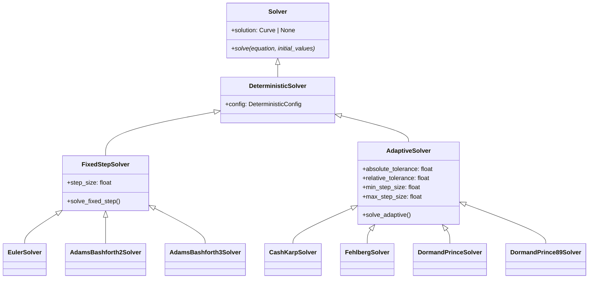
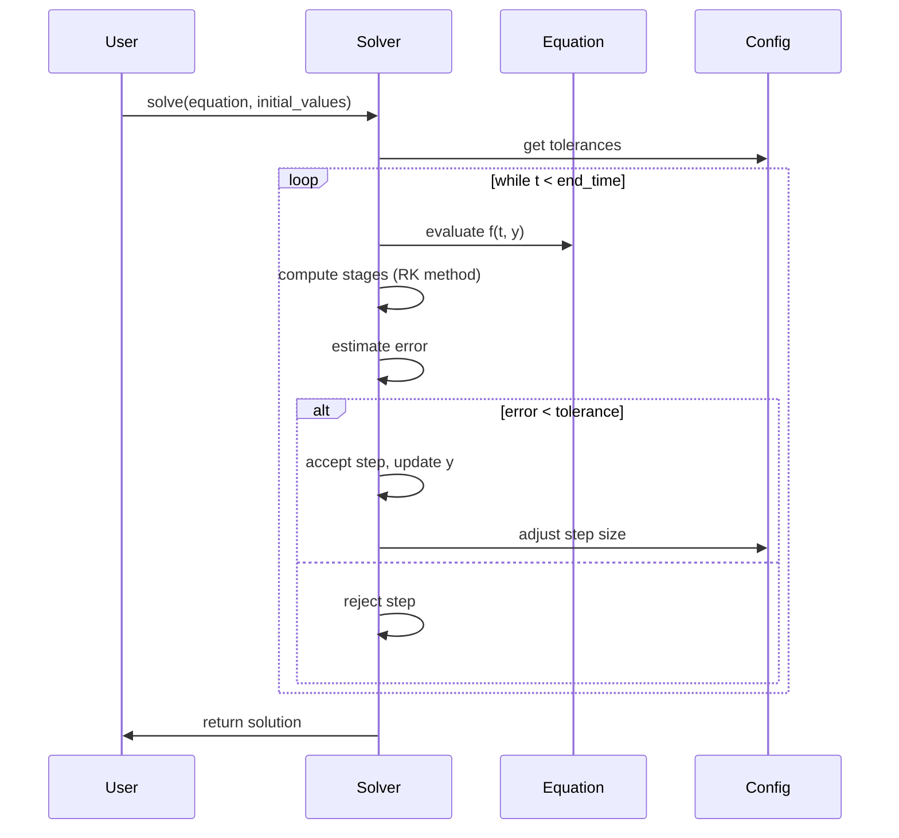

# DETERMINISTIC

## Overview

The `deterministic` submodule provides numerical algorithms for solving ordinary differential equations (ODEs) using deterministic methods. This includes fixed-step and adaptive-step Runge-Kutta methods optimized for systems without stochastic noise.

## Architecture

```
Deterministic Solvers
├── EulerSolver - Basic first-order method
├── AdamsBashforth2Solver - 2nd order multistep
├── AdamsBashforth3Solver - 3rd order multistep
├── CashKarpSolver - 4th/5th order adaptive RK
├── FehlbergSolver - 4th/5th order adaptive RK
├── DormandPrinceSolver - 5th/4th order adaptive RK
└── DormandPrince89Solver - 8th/9th order adaptive RK
```

## Executive Summary

**Purpose**: Solve deterministic ODE systems with high accuracy and efficiency
**Key Features**: Multiple integration orders, adaptive step sizing, error control
**Performance**: Excellent for smooth, non-stiff ODE systems
**Use Cases**: Physics simulations, chemical kinetics, control systems

## Core Classes

### EulerSolver

```python
class EulerSolver(Solver):
    """First-order explicit Euler method for ODEs."""

    def solve(self, equation: DifferentialEquation, initial_values: list[float]):
        """Solve ODE using forward Euler method."""
```

### Adaptive Solvers

All adaptive solvers inherit from a common base with error estimation:

```python
class AdaptiveSolver(Solver):
    """Base class for adaptive Runge-Kutta methods."""

    def _estimate_error(self, y_high, y_low) -> float:
        """Estimate local truncation error."""

    def _adjust_step_size(self, error, tolerance) -> float:
        """Compute optimal step size."""
```

## UML Class Diagram



## Sequence Diagram - Adaptive Solving



## Folder Structure

```
deterministic/
├── __init__.py
├── DETERMINISTIC.md
├── euler/
│   ├── __init__.py
│   ├── euler_config.py
│   └── euler_solver.py
├── adams_bashforth2/
│   ├── __init__.py
│   ├── adams_bashforth2_config.py
│   └── adams_bashforth2_solver.py
├── adams_bashforth3/
│   ├── __init__.py
│   ├── adams_bashforth3_config.py
│   └── adams_bashforth3_solver.py
├── cash_karp/
│   ├── __init__.py
│   ├── cash_karp_config.py
│   └── cash_karp_solver.py
├── fehlberg/
│   ├── __init__.py
│   ├── fehlberg_config.py
│   └── fehlberg_solver.py
├── dormand_prince/
│   ├── __init__.py
│   ├── dormand_prince_config.py
│   └── dormand_prince_solver.py
└── dormand_prince89/
    ├── __init__.py
    ├── dormand_prince89_config.py
    └── dormand_prince89_solver.py
```

## Examples

### Basic ODE Solution

```python
from discrecontinual_equations.solver.deterministic.euler import EulerConfig, EulerSolver
from discrecontinual_equations import DifferentialEquation, Variable

# Define dy/dt = -y
class Decay(DeterministicFunction):
    def eval(self, point, time=None):
        return [-point[0]]

# Setup and solve
y = Variable(name="y")
equation = DifferentialEquation(variables=[y], derivative=Decay(variables=[y]))

config = EulerConfig(start_time=0, end_time=5, step_size=0.1)
solver = EulerSolver(config)
solver.solve(equation, [1.0])
```

### Adaptive Solving with Error Control

```python
from discrecontinual_equations.solver.deterministic.dormand_prince import DormandPrinceConfig, DormandPrinceSolver

config = DormandPrinceConfig(
    start_time=0, end_time=10,
    initial_step_size=0.1,
    absolute_tolerance=1e-8,
    relative_tolerance=1e-6
)

solver = DormandPrinceSolver(config)
solver.solve(equation, [1.0])
```

## Functionality Explanation

### Fixed-Step Methods
- **Euler**: Simple forward difference, O(h) accuracy
- **Adams-Bashforth**: Linear multistep methods using previous values
- **Advantage**: Predictable computation time, simple implementation
- **Limitation**: Fixed accuracy regardless of problem stiffness

### Adaptive Methods
- **Embedded RK Pairs**: Simultaneously compute two approximations
- **Error Estimation**: Difference gives local truncation error
- **Step Adjustment**: PI controller optimizes step size
- **Advantage**: Automatic accuracy control, efficient for varying stiffness

### Error Control Algorithm

```python
error_estimate = ||y_{higher} - y_{lower}||
scaled_error = error_estimate / (atol + rtol * ||y||)

if scaled_error <= 1:
    accept_step = True
    optimal_h = h * safety * (scaled_error)^(-1/(min_order+1))
else:
    accept_step = False
    optimal_h = h * safety * (scaled_error)^(-1/(min_order+1))
```

## Performance Characteristics

| Method | Order | Stages/Step | Adaptive | Relative Speed |
|--------|-------|-------------|----------|----------------|
| Euler | 1 | 1 | No | Fastest |
| Adams-Bashforth 2 | 2 | 1 | No | Fast |
| Adams-Bashforth 3 | 3 | 1 | No | Fast |
| Cash-Karp | 4/5 | 6 | Yes | Medium |
| Fehlberg | 4/5 | 6 | Yes | Medium |
| Dormand-Prince | 5/4 | 7 | Yes | Medium |
| Dormand-Prince 89 | 8/9 | 13 | Yes | Slowest |

## References

- Hairer, E., et al. (1993). *Solving Ordinary Differential Equations I*
- Press, W.H., et al. (1992). *Numerical Recipes in C*
- Shampine, L.F. (1994). *The MATLAB ODE Suite*

---

**Parent Module:** [SOLVER](../SOLVER.md)

**Child Modules:**
- [EULER](euler/EULER.md)
- [ADAMS_BASHFORTH2](adams_bashforth2/ADAMS_BASHFORTH2.md)
- [ADAMS_BASHFORTH3](adams_bashforth3/ADAMS_BASHFORTH3.md)
- [CASH_KARP](cash_karp/CASH_KARP.md)
- [FEHLBERG](fehlberg/FEHLBERG.md)
- [DORMAND_PRINCE](dormand_prince/DORMAND_PRINCE.md)
- [DORMAND_PRINCE89](dormand_prince89/DORMAND_PRINCE89.md)
