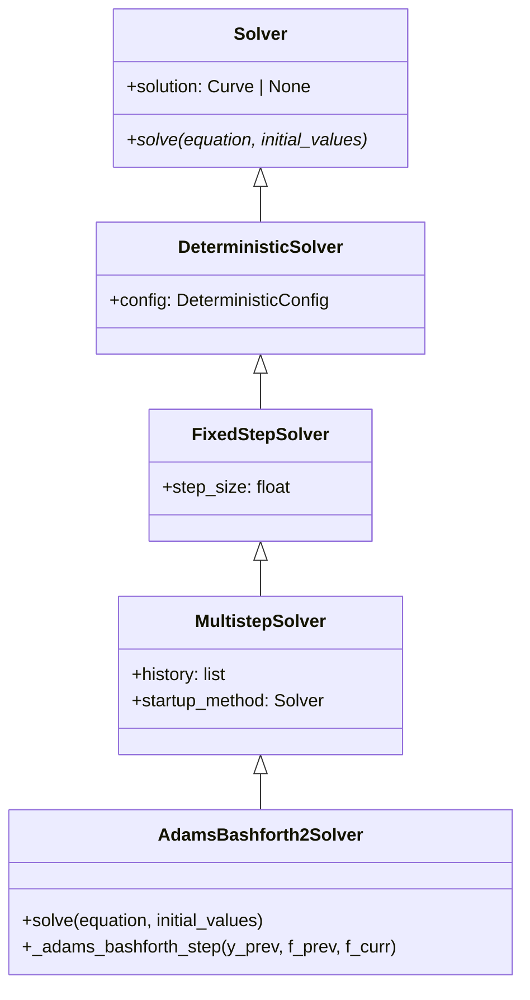
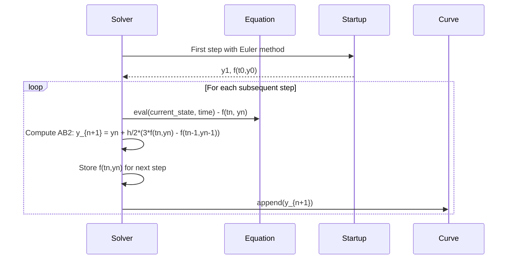

# ADAMS_BASHFORTH2

## Overview

The Adams-Bashforth 2 method is a second-order linear multistep method for solving ordinary differential equations. It uses information from the current and previous time steps to achieve higher accuracy than single-step methods like Euler.

## Architecture

```
AdamsBashforth2Solver
├── Config: start_time, end_time, step_size
├── Method: 2-step linear multistep (Adams-Bashforth)
├── Order: 2nd order, O(h²)
└── Startup: Requires Euler or other single-step method
```

## Executive Summary

**Purpose**: Higher-accuracy ODE solver with multistep approach
**Key Features**: Uses previous step information, 2nd order accuracy, efficient for smooth problems
**Performance**: Good balance of accuracy and computational cost
**Use Cases**: Smooth ODEs, long-time integration, physics simulations

## Core Classes

### AdamsBashforth2Config

```python
class AdamsBashforth2Config(SolverConfig):
    """Configuration for Adams-Bashforth 2 method."""

    start_time: float = 0.0
    end_time: float = 1.0
    step_size: float = 0.01
```

### AdamsBashforth2Solver

```python
class AdamsBashforth2Solver(Solver):
    """Second-order Adams-Bashforth method."""

    def solve(self, equation: DifferentialEquation, initial_values: list[float]):
        """Solve ODE using Adams-Bashforth 2 method."""
```

## UML Class Diagram



## Sequence Diagram - Adams-Bashforth 2



## Folder Structure

```
adams_bashforth2/
├── __init__.py
├── adams_bashforth2_config.py
├── adams_bashforth2_solver.py
└── ADAMS_BASHFORTH2.md
```

## Examples

### Population Growth

```python
from discrecontinual_equations.solver.deterministic.adams_bashforth2 import AdamsBashforth2Config, AdamsBashforth2Solver

# Logistic growth: dP/dt = r*P*(1 - P/K)
class LogisticGrowth(DeterministicFunction):
    def eval(self, point, time=None):
        P = point[0]
        r = self.parameters[0].value  # growth rate
        K = self.parameters[1].value  # carrying capacity
        return [r * P * (1 - P/K)]

config = AdamsBashforth2Config(start_time=0, end_time=50, step_size=0.1)
solver = AdamsBashforth2Solver(config)
solver.solve(equation, [1.0])  # Start with 1 individual
```

### Damped Harmonic Oscillator

```python
# d²x/dt² + γ dx/dt + ω²x = 0
class DampedOscillator(DeterministicFunction):
    def eval(self, point, time=None):
        x, v = point  # position, velocity
        gamma = self.parameters[0].value  # damping
        omega = self.parameters[1].value   # frequency
        return [v, -gamma*v - omega**2*x]

config = AdamsBashforth2Config(start_time=0, end_time=20, step_size=0.01)
solver = AdamsBashforth2Solver(config)
solver.solve(equation, [1.0, 0.0])  # x=1, v=0
```

## Functionality Explanation

### Mathematical Foundation

The Adams-Bashforth 2 method uses the formula:

```
y_{n+1} = y_n + (h/2) * (3*f(t_n, y_n) - f(t_{n-1}, y_{n-1}))
```

This is derived from the Newton backward difference interpolation of the integral form of the ODE.

### Multistep Nature

- **Requires startup**: First step uses Euler method to get y₁ and f(t₀,y₀)
- **History dependence**: Uses information from previous step
- **Memory efficient**: Only stores one previous function value

### Convergence Properties

- **Order**: 2nd order - `|y(t) - ŷ(t)| = O(h²)`
- **Local Error**: O(h³) per step
- **Global Error**: O(h²) over the interval
- **Zero-stable**: Method is zero-stable

## Algorithm Details

### Startup Phase

```python
def solve(self, equation, initial_values):
    # First step using Euler
    y0 = np.array(initial_values)
    f0 = np.array(equation.derivative.eval(y0, self.start_time))

    y1 = y0 + self.step_size * f0
    t1 = self.start_time + self.step_size

    # Store for AB2
    self._prev_f = f0
    self.solution.append([self.start_time, [], y0.tolist()])
    self.solution.append([t1, [], y1.tolist()])
```

### Adams-Bashforth 2 Step

```python
def _adams_bashforth_2_step(self, y_curr, f_curr, h):
    """Perform Adams-Bashforth 2 step."""
    # AB2 formula: y_{n+1} = y_n + (h/2)*(3*f_n - f_{n-1})
    y_next = y_curr + (h/2) * (3 * f_curr - self._prev_f)

    # Update history
    self._prev_f = f_curr

    return y_next
```

## Error Analysis

### Local Truncation Error

The LTE for Adams-Bashforth 2 is:
```
τ_{n+1} = - (5/12) h³ y'''(t_n) + O(h⁴)
```

### Global Error Accumulation

For smooth problems with bounded derivatives:
```
|y(t_N) - ŷ(t_N)| ≤ C h²
```

Where C depends on the problem's smoothness.

## Performance Characteristics

| Method | Order | Steps/Function Call | Stability | Memory |
|--------|-------|-------------------|-----------|--------|
| Euler | 1 | 1 | Limited | O(1) |
| AB2 | 2 | 1 | Good | O(1) |
| RK4 | 4 | 4 | Excellent | O(1) |

## Applications

### Physics and Engineering
- **Orbital mechanics**: Satellite trajectories
- **Circuit analysis**: RLC circuit simulation
- **Structural dynamics**: Building response analysis

### Biology and Chemistry
- **Population models**: Predator-prey systems
- **Chemical kinetics**: Reaction rate equations
- **Epidemiology**: Disease spread models

### Control Systems
- **Linear systems**: State space representations
- **Feedback control**: System response analysis
- **Stability analysis**: Lyapunov function evaluation

## Limitations

### Startup Issues
- **First step accuracy**: Depends on startup method
- **Warm-up period**: One step of reduced accuracy

### Stability Considerations
- **Nonlinear problems**: May require smaller steps than predicted
- **Stiff systems**: Less stable than implicit methods

## References

- Adams, John Couch (1855). "On the correction of the aberrations of the planets"
- Bashforth, Francis (1883). "An Attempt to test the Theories of Capillary Action"
- Lambert, J.D. (1973). "Computational Methods in Ordinary Differential Equations"

---

**Parent Module:** [DETERMINISTIC](../DETERMINISTIC.md)

**Related Modules:**
- [EULER](../euler/EULER.md) - Single-step method for startup
- [ADAMS_BASHFORTH3](../adams_bashforth3/ADAMS_BASHFORTH3.md) - Higher-order Adams method
