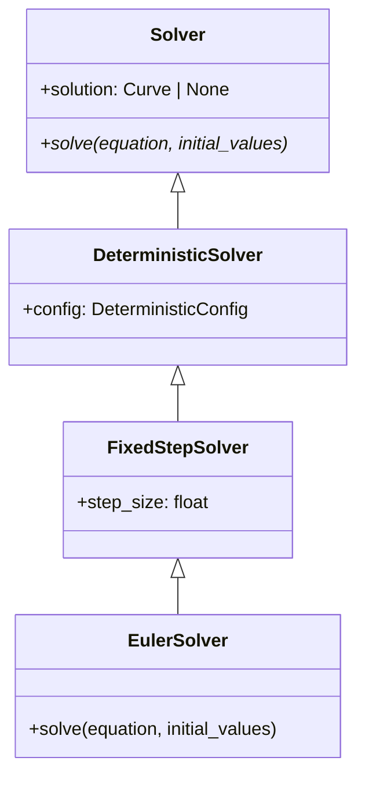
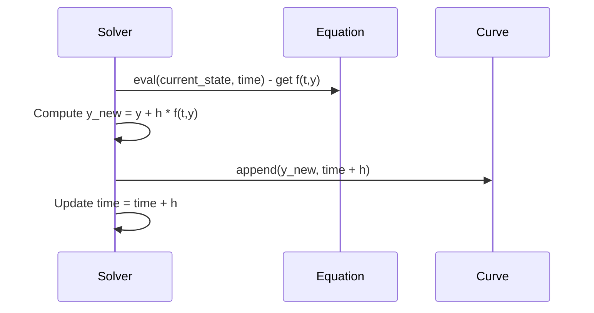

# EULER

## Overview

The Euler method is the fundamental first-order numerical algorithm for solving ordinary differential equations. It represents the simplest approach to numerical integration, using forward differences to approximate derivatives.

## Architecture

```
EulerSolver
├── Config: start_time, end_time, step_size
├── Method: First-order explicit forward Euler
├── Order: 1st order, O(h)
└── Stability: Conditionally stable
```

## Executive Summary

**Purpose**: Basic ODE solver for educational and baseline comparisons
**Key Features**: Simple implementation, explicit formulation, foundation method
**Performance**: Fast execution, acceptable for rough approximations
**Use Cases**: Educational examples, baseline accuracy comparisons, simple problems

## Core Classes

### EulerConfig

```python
class EulerConfig(SolverConfig):
    """Configuration for Euler method."""

    start_time: float = 0.0
    end_time: float = 1.0
    step_size: float = 0.01
```

### EulerSolver

```python
class EulerSolver(Solver):
    """First-order explicit Euler method."""

    def solve(self, equation: DifferentialEquation, initial_values: list[float]):
        """Solve ODE using explicit Euler method."""
```

## UML Class Diagram



## Sequence Diagram - Euler Step



## Folder Structure

```
euler/
├── __init__.py
├── euler_config.py
├── euler_solver.py
└── EULER.md
```

## Examples

### Exponential Decay

```python
from discrecontinual_equations.solver.deterministic.euler import EulerConfig, EulerSolver

# dy/dt = -k*y
class ExponentialDecay(DeterministicFunction):
    def eval(self, point, time=None):
        y = point[0]
        k = self.parameters[0].value
        return [-k * y]

config = EulerConfig(start_time=0, end_time=5, step_size=0.1)
solver = EulerSolver(config)
solver.solve(equation, [1.0])  # y(0) = 1
```

### Harmonic Oscillator

```python
# d²x/dt² = -ω²x (system of 2 first-order ODEs)
class HarmonicOscillator(DeterministicFunction):
    def eval(self, point, time=None):
        x, v = point  # position, velocity
        omega = self.parameters[0].value
        return [v, -omega**2 * x]  # [dx/dt, dv/dt]

config = EulerConfig(start_time=0, end_time=10, step_size=0.01)
solver = EulerSolver(config)
solver.solve(equation, [1.0, 0.0])  # x=1, v=0
```

## Functionality Explanation

### Mathematical Foundation

For an ODE `dy/dt = f(t,y)` with initial condition `y(t₀) = y₀`, the Euler method approximates:

```
y_{n+1} = y_n + h * f(t_n, y_n)
```

Where `h` is the step size and `t_{n+1} = t_n + h`.

### Convergence Properties

- **Order**: 1st order - `|y(t) - ŷ(t)| = O(h)`
- **Local Error**: O(h²) per step
- **Global Error**: O(h) over the interval
- **Consistency**: Method is consistent with the ODE

### Stability Analysis

- **Region of Stability**: Left half-plane for `|1 + hλ| ≤ 1`
- **Dahlquist Barrier**: Cannot be A-stable beyond order 2
- **Practical Stability**: Requires small step sizes for stiff problems

## Algorithm Details

### Single Time Step

```python
def _euler_step(self, y, t, h, equation):
    """Perform one Euler step."""
    # Evaluate derivative
    derivative = equation.derivative.eval(y, t)

    # Euler update
    y_new = y + h * np.array(derivative)

    return y_new
```

### Complete Solving Process

```python
def solve(self, equation, initial_values):
    # Initialize
    t = self.start_time
    y = np.array(initial_values)
    self.solution = Curve(...)

    # Time stepping
    while t < self.end_time:
        y = self._euler_step(y, t, self.step_size, equation)
        t += self.step_size
        self.solution.append([t, [], y.tolist()])
```

## Error Analysis

### Local Truncation Error

The local error arises from truncating the Taylor series:
```
y(t+h) = y(t) + h y'(t) + (h²/2) y''(t) + O(h³)
ŷ(t+h) = y(t) + h f(t,y(t))
```

Local error: `τ(h) = (h²/2) y''(t) + O(h³) = O(h²)`

### Global Error Accumulation

For smooth problems, global error accumulates as:
```
|y(t_N) - ŷ(t_N)| ≤ (h/2) * max|y''(t)| * T + O(h²)
```

Where T is the total integration time.

## Performance Characteristics

| Aspect | Euler Method |
|--------|--------------|
| **Computational Cost** | O(N) function evaluations |
| **Memory Usage** | Minimal O(1) |
| **Accuracy** | Basic O(h) global error |
| **Stability** | Conditionally stable |
| **Implementation** | Very simple |

## Applications

### Educational Use
- **Teaching**: Introduction to numerical methods
- **Understanding**: Basic discretization concepts
- **Comparison**: Baseline for more advanced methods

### Simple Physical Systems
- **Free fall**: `dv/dt = -g` (no air resistance)
- **Radioactive decay**: `dN/dt = -λN`
- **RC circuits**: Simple electrical circuits

### Baseline Comparisons
- **Method comparison**: Reference for accuracy studies
- **Step size studies**: Demonstrate convergence behavior
- **Stability analysis**: Show limitations of explicit methods

## Limitations and Considerations

### Accuracy Limitations
- **Low order**: Requires small step sizes for accuracy
- **Error accumulation**: Global error grows linearly with T
- **Stiff problems**: May require impractically small steps

### Stability Issues
- **Explicit method**: Cannot handle very stiff problems
- **Step size restriction**: CFL-like condition for stability
- **Nonlinear problems**: May require adaptive stepping

## References

- Euler, Leonhard (1768). "Institutionum calculi integralis"
- Butcher, J.C. (2008). "Numerical Methods for Ordinary Differential Equations"
- Hairer, E., et al. (1993). "Solving Ordinary Differential Equations I"

---

**Parent Module:** [DETERMINISTIC](../DETERMINISTIC.md)

**Related Modules:**
- [ADAMS_BASHFORTH2](../adams_bashforth2/ADAMS_BASHFORTH2.md) - Higher-order multistep method
- [CASH_KARP](../cash_karp/CASH_KARP.md) - Adaptive Runge-Kutta method
