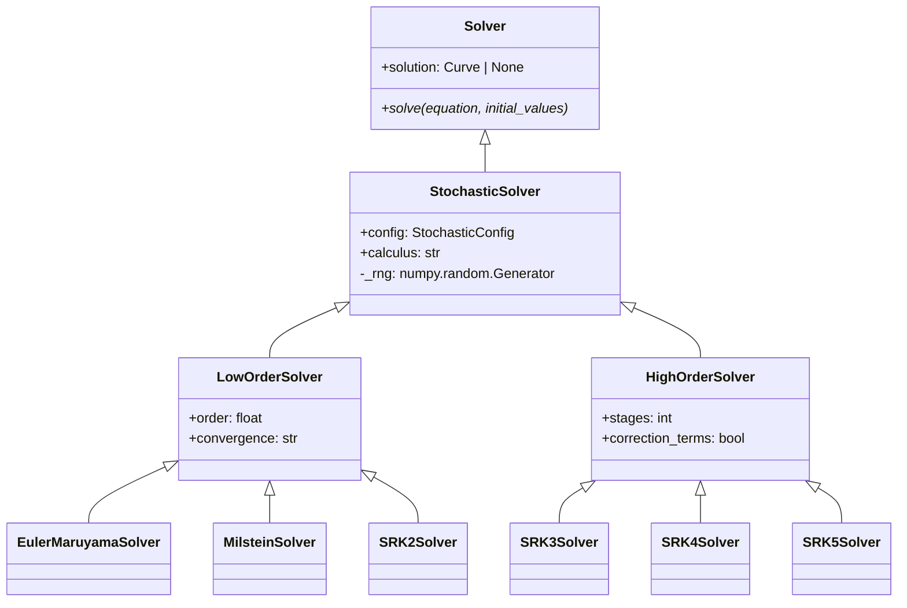
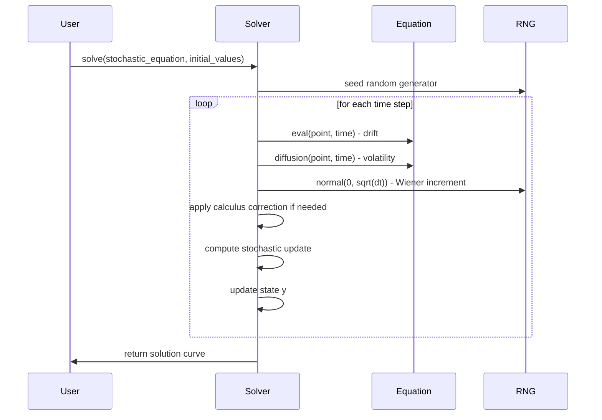

# STOCHASTIC

## Overview

The `stochastic` submodule provides numerical algorithms for solving stochastic differential equations (SDEs) with support for both Ito and Stratonovich calculus interpretations. This includes methods ranging from basic Euler-Maruyama to high-order Stochastic Runge-Kutta schemes.

## Architecture

```
Stochastic Solvers
├── EulerMaruyamaSolver - Strong order 0.5, weak order 1.0
├── MilsteinSolver - Strong order 1.0, weak order 1.0
├── SRK2Solver - Strong order 1.0, weak order 1.0
├── SRK3Solver - Strong order 1.5, weak order 3.0
├── SRK4Solver - Strong order 2.0, weak order 4.0
├── SRK5Solver - Strong order 2.5, weak order 5.0
├── GottwaldMelbourneSolver - Deterministic homogenisation for α-stable SDEs
└── ZhanDuanLiLiSolver - Zhan-Duan-Li-Li method for SDEs
```

## Executive Summary

**Purpose**: Solve SDE systems with stochastic noise and calculus interpretation support
**Key Features**: Multiple convergence orders, Ito/Stratonovich calculus, reproducible simulations
**Performance**: Specialized for stochastic processes with Wiener increments
**Use Cases**: Financial modeling, physical systems with noise, population dynamics

## Core Classes

### Base Stochastic Solver

```python
class StochasticSolver(Solver):
    """Base class for stochastic differential equation solvers."""

    def __init__(self, solver_config: StochasticConfig):
        """Initialize with random seed support."""

    def _generate_wiener_increment(self, dt: float) -> float:
        """Generate N(0, dt) Wiener increment."""
```

### Calculus Support

All stochastic solvers support calculus selection:

```python
class StochasticConfig(SolverConfig):
    """Configuration with calculus interpretation."""

    calculus: Literal["ito", "stratonovich"] = "ito"

    def apply_calculus_correction(self, drift, diffusion) -> tuple:
        """Apply Ito ↔ Stratonovich conversion if needed."""
```

## UML Class Diagram



## Sequence Diagram - SDE Solving



## Folder Structure

```
stochastic/
├── __init__.py
├── STOCHASTIC.md
├── euler_maruyama/
│   ├── __init__.py
│   ├── euler_maruyama_config.py
│   ├── euler_maruyama_solver.py
│   └── EULER_MARUYAMA.md
├── milstein/
│   ├── __init__.py
│   ├── milstein_config.py
│   ├── milstein_solver.py
│   └── MILSTEIN.md
├── srk2/
│   ├── __init__.py
│   ├── srk2_config.py
│   ├── srk2_solver.py
│   └── SRK2.md
├── srk3/
│   ├── __init__.py
│   ├── srk3_config.py
│   ├── srk3_solver.py
│   └── SRK3.md
├── srk4/
│   ├── __init__.py
│   ├── srk4_config.py
│   ├── srk4_solver.py
│   └── SRK4.md
├── srk5/
│   ├── __init__.py
│   ├── srk5_config.py
│   ├── srk5_solver.py
│   └── SRK5.md
├── gottwald_melbourne/
│   ├── __init__.py
│   ├── gottwald_melbourne_config.py
│   ├── gottwald_melbourne_solver.py
│   └── GOTTWALD_MELBOURNE.md
└── zhan_duan_li_li/
    ├── __init__.py
    ├── zhan_duan_li_li_config.py
    ├── zhan_duan_li_li_solver.py
    └── ZHAN_DUAN_LI_LI.md
```

## Examples

### Basic SDE Solution

```python
from discrecontinual_equations.solver.stochastic.euler_maruyama import EulerMaruyamaConfig, EulerMaruyamaSolver

# Geometric Brownian motion: dX = μX dt + σX dW
class GBM(StochasticFunction):
    def eval(self, point, time=None):
        x, mu, sigma = point[0], self.parameters[0].value, self.parameters[1].value
        return [mu * x]  # Drift

    def diffusion(self, point, time=None):
        x, sigma = point[0], self.parameters[1].value
        return [sigma * x]  # Volatility

# Solve with Ito calculus
config = EulerMaruyamaConfig(
    start_time=0, end_time=1, step_size=0.01,
    calculus="ito", random_seed=42
)
solver = EulerMaruyamaSolver(config)
solver.solve(equation, [100.0])  # Start at $100
```

### High-Order Stochastic Solving

```python
from discrecontinual_equations.solver.stochastic.srk4 import SRK4Config, SRK4Solver

# Use SRK4 for high accuracy
config = SRK4Config(
    start_time=0, end_time=1, step_size=0.001,
    calculus="stratonovich", random_seed=123
)

solver = SRK4Solver(config)
solver.solve(stochastic_equation, [1.0])
```

## Functionality Explanation

### Convergence Orders
- **Strong Order**: Convergence of solution paths
- **Weak Order**: Convergence of expected values
- **Trade-off**: Higher orders require more function evaluations

### Calculus Interpretations

**Ito SDEs**: `dX = μ(X,t)dt + σ(X,t)dW`
- Standard in mathematical finance
- Corresponds to limit of discrete approximations

**Stratonovich SDEs**: `dX = μ(X,t)dt + σ(X,t) ∘ dW`
- Equivalent to Ito with modified drift: `μ_corrected = μ - (1/2)σ∂σ/∂x`
- Natural for physical systems

### Wiener Process Generation

```python
# Generate independent Wiener increments
dW = np.random.normal(0, np.sqrt(dt), size=n_dimensions)

# Ensure reproducibility with seeds
np.random.seed(seed)
wiener_increments = np.random.normal(0, np.sqrt(dt), size=(n_steps, n_dim))
```

## Performance Characteristics

| Method | Strong Order | Weak Order | Stages/Step | Relative Speed |
|--------|-------------|------------|-------------|----------------|
| Euler-Maruyama | 0.5 | 1.0 | 1 | Fastest |
| Milstein | 1.0 | 1.0 | 1 | Fast |
| SRK2 | 1.0 | 1.0 | 2 | Medium |
| SRK3 | 1.5 | 3.0 | 3 | Medium |
| SRK4 | 2.0 | 4.0 | 4 | Slow |
| SRK5 | 2.5 | 5.0 | 5 | Slowest |

## Calculus Conversion Algorithm

For Stratonovich → Ito conversion:

```python
def apply_stratonovich_correction(drift, diffusion, point):
    """Convert Stratonovich to Ito calculus."""
    eps = 1e-8
    # Numerical differentiation
    diffusion_plus = diffusion(point + eps)
    diffusion_minus = diffusion(point - eps)
    dsigma_dx = (diffusion_plus - diffusion_minus) / (2 * eps)

    # Apply correction
    corrected_drift = drift - 0.5 * diffusion * dsigma_dx
    return corrected_drift, diffusion
```

## References

- Kloeden, P.E. & Platen, E. (1992). *Numerical Solution of Stochastic Differential Equations*
- Milstein, G.N. (1995). *Numerical Integration of Stochastic Differential Equations*
- Rößler, A. (2006). *Runge-Kutta Methods for Stochastic Differential Equations*
- Øksendal, B. (2003). *Stochastic Differential Equations*

---

**Parent Module:** [SOLVER](../SOLVER.md)

**Child Modules:**
- [EULER_MARUYAMA](euler_maruyama/EULER_MARUYAMA.md)
- [MILSTEIN](milstein/MILSTEIN.md)
- [SRK2](srk2/SRK2.md)
- [SRK3](srk3/SRK3.md)
- [SRK4](srk4/SRK4.md)
- [SRK5](srk5/SRK5.md)
- [GOTTWALD_MELBOURNE](gottwald_melbourne/GOTTWALD_MELBOURNE.md)
- [ZHAN_DUAN_LI_LI](zhan_duan_li_li/ZHAN_DUAN_LI_LI.md)
