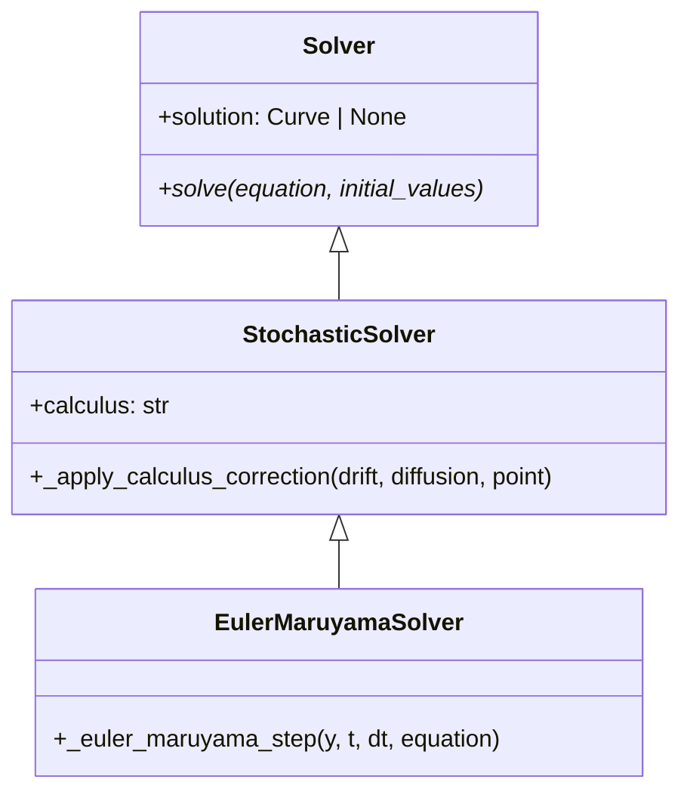
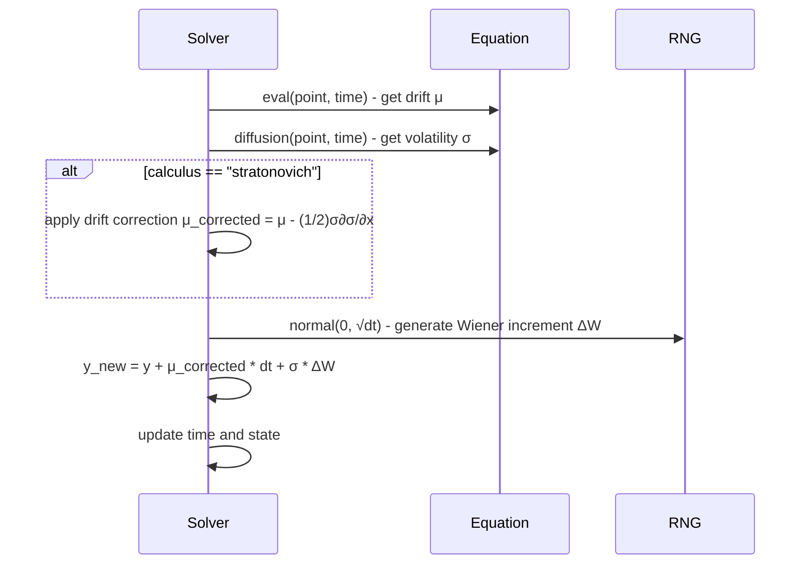

# EULER_MARUYAMA

## Overview

The Euler-Maruyama method is the fundamental numerical algorithm for solving stochastic differential equations (SDEs). It extends the deterministic Euler method to handle stochastic processes by incorporating Wiener increments.

## Architecture

```
EulerMaruyamaSolver
├── Config: start_time, end_time, step_size, random_seed, calculus
├── Method: Explicit Euler with stochastic increments
├── Order: Strong 0.5, Weak 1.0
└── Calculus: Supports Ito and Stratonovich
```

## Executive Summary

**Purpose**: Basic stochastic differential equation solver
**Key Features**: Simple implementation, calculus flexibility, foundation method
**Performance**: Fastest stochastic solver, good for rough approximations
**Use Cases**: Prototyping, educational purposes, baseline comparisons

## Core Classes

### EulerMaruyamaConfig

```python
class EulerMaruyamaConfig(SolverConfig):
    """Configuration for Euler-Maruyama method."""

    start_time: float = 0.0
    end_time: float = 1.0
    step_size: float = 0.01
    random_seed: int | None = None
    calculus: Literal["ito", "stratonovich"] = "ito"
```

### EulerMaruyamaSolver

```python
class EulerMaruyamaSolver(Solver):
    """Euler-Maruyama method for SDEs."""

    def solve(self, equation: DifferentialEquation, initial_values: list[float]):
        """Solve SDE using Euler-Maruyama method."""

    def _apply_calculus_correction(self, drift, diffusion, point):
        """Apply Ito ↔ Stratonovich conversion."""
```

## UML Class Diagram



## Sequence Diagram - Single Step



## Folder Structure

```
euler_maruyama/
├── __init__.py
├── euler_maruyama_config.py
├── euler_maruyama_solver.py
└── EULER_MARUYAMA.md
```

## Examples

### Basic Brownian Motion

```python
from discrecontinual_equations.solver.stochastic.euler_maruyama import EulerMaruyamaConfig, EulerMaruyamaSolver

# dX = μ dt + σ dW (Brownian motion with drift)
class BrownianMotion(StochasticFunction):
    def eval(self, point, time=None):
        return [0.1]  # Constant drift μ = 0.1

    def diffusion(self, point, time=None):
        return [0.2]  # Constant volatility σ = 0.2

config = EulerMaruyamaConfig(
    start_time=0, end_time=10, step_size=0.01,
    calculus="ito", random_seed=42
)

solver = EulerMaruyamaSolver(config)
solver.solve(equation, [0.0])  # Start at 0
```

### Geometric Brownian Motion

```python
# dX = μX dt + σX dW (Black-Scholes model)
class GeometricBM(StochasticFunction):
    def eval(self, point, time=None):
        x = point[0]
        return [0.05 * x]  # Drift: 5% growth

    def diffusion(self, point, time=None):
        x = point[0]
        return [0.2 * x]   # Volatility: 20%

config = EulerMaruyamaConfig(
    start_time=0, end_time=1, step_size=0.001,
    calculus="ito", random_seed=123
)

solver = EulerMaruyamaSolver(config)
solver.solve(equation, [100.0])  # Start with $100
```

## Functionality Explanation

### Mathematical Foundation

For an SDE `dX = μ(X,t)dt + σ(X,t)dW`, the Euler-Maruyama discretization is:

```
X_{n+1} = X_n + μ(X_n, t_n) Δt + σ(X_n, t_n) ΔW_n
```

Where `ΔW_n ~ N(0, Δt)` is a Wiener increment.

### Convergence Properties

- **Strong Order**: 0.5 - path-wise convergence
- **Weak Order**: 1.0 - convergence of expected values
- **Limitation**: Lower accuracy compared to higher-order methods

### Calculus Support

**Ito Formulation**: Direct discretization of the given SDE
**Stratonovich Conversion**: Automatically applies drift correction for equivalent Stratonovich interpretation

### Random Number Generation

```python
# Reproducible Wiener increments
np.random.seed(self.random_seed)
dW = np.random.normal(0, np.sqrt(dt), size=len(y))
```

## Algorithm Details

### Single Time Step

```python
def _euler_maruyama_step(self, y, t, dt, equation):
    # Evaluate drift and diffusion
    drift = equation.derivative.eval(y, t)
    diffusion = equation.derivative.diffusion(y, t)

    # Apply calculus correction if needed
    if self.calculus == "stratonovich":
        drift = self._apply_stratonovich_correction(drift, diffusion, y)

    # Generate Wiener increment
    dW = np.random.normal(0, np.sqrt(dt), len(y))

    # Euler-Maruyama update
    y_new = y + np.array(drift) * dt + np.array(diffusion) * dW

    return y_new
```

### Stratonovich Correction

```python
def _apply_stratonovich_correction(self, drift, diffusion, point):
    """Convert Ito to Stratonovich calculus."""
    eps = 1e-8
    # Numerical differentiation
    diff_plus = equation.derivative.diffusion(point + eps, t)
    diff_minus = equation.derivative.diffusion(point - eps, t)
    dsigma_dx = (diff_plus - diff_minus) / (2 * eps)

    # Apply correction
    corrected_drift = drift - 0.5 * diffusion * dsigma_dx
    return corrected_drift
```

## Performance Characteristics

| Aspect | Performance |
|--------|-------------|
| **Computational Cost** | O(1) per step |
| **Memory Usage** | Minimal |
| **Accuracy** | Basic (order 0.5/1.0) |
| **Stability** | Conditionally stable |
| **Parallelization** | Limited by random numbers |

## Error Analysis

### Local Truncation Error
- `O(Δt)` for deterministic part
- `O(√Δt)` for stochastic part
- Combined: `O(Δt^{1/2})` strong convergence

### Global Error
- Strong convergence: `O(Δt^{1/2})`
- Weak convergence: `O(Δt)`

### Bias and Variance
- **Bias**: Systematic error from discretization
- **Variance**: Monte Carlo sampling variance
- **Total MSE**: Bias² + Variance

## References

- Maruyama, G. (1955). "Continuous Markov processes and stochastic equations"
- Kloeden, P.E. & Platen, E. (1992). "Numerical Solution of Stochastic Differential Equations"
- Øksendal, B. (2003). "Stochastic Differential Equations: An Introduction"

---

**Parent Module:** [STOCHASTIC](../STOCHASTIC.md)

**Related Modules:**
- [MILSTEIN](../milstein/MILSTEIN.md) - Higher-order stochastic method
- [SRK2](../srk2/SRK2.md) - Stochastic Runge-Kutta method
