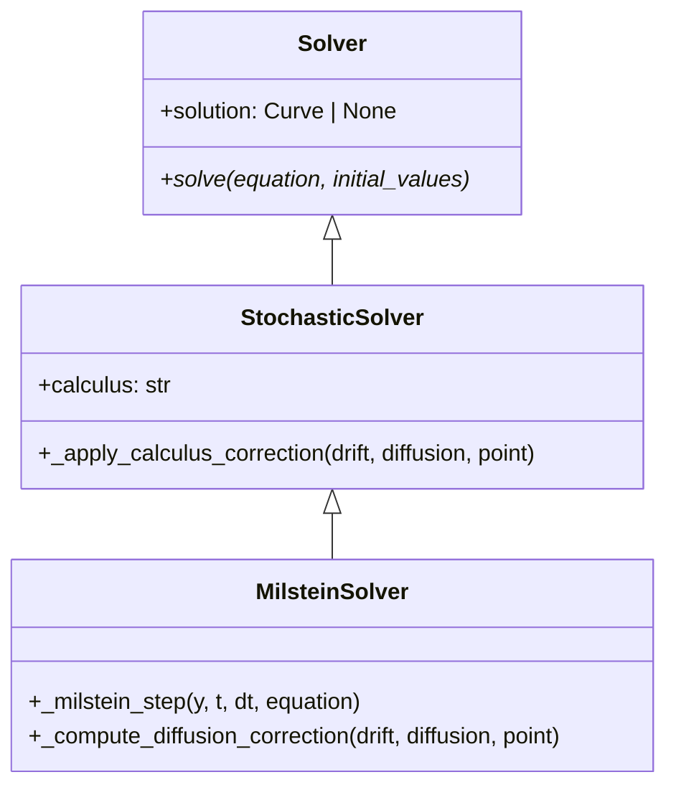
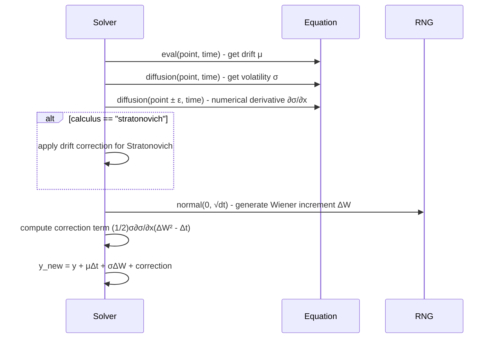

# MILSTEIN

## Overview

The Milstein method is a higher-order numerical algorithm for stochastic differential equations that improves upon Euler-Maruyama by including second-order Ito-Taylor expansion terms. It achieves strong order 1.0 convergence while maintaining computational efficiency.

## Architecture

```
MilsteinSolver
├── Config: start_time, end_time, step_size, random_seed, calculus
├── Method: Ito-Taylor expansion with diffusion correction
├── Order: Strong 1.0, Weak 1.0
└── Calculus: Supports Ito and Stratonovich
```

## Executive Summary

**Purpose**: Higher-accuracy stochastic differential equation solver
**Key Features**: Diffusion correction term, Ito-Taylor expansion, calculus flexibility
**Performance**: Good balance of accuracy and speed for SDEs
**Use Cases**: Financial modeling, systems with multiplicative noise

## Core Classes

### MilsteinConfig

```python
class MilsteinConfig(SolverConfig):
    """Configuration for Milstein method."""

    start_time: float = 0.0
    end_time: float = 1.0
    step_size: float = 0.01
    random_seed: int | None = None
    calculus: Literal["ito", "stratonovich"] = "ito"
```

### MilsteinSolver

```python
class MilsteinSolver(Solver):
    """Milstein method for SDEs with diffusion correction."""

    def solve(self, equation: DifferentialEquation, initial_values: list[float]):
        """Solve SDE using Milstein method."""

    def _milstein_step(self, y, t, dt, equation):
        """Single Milstein step with correction."""
```

## UML Class Diagram



## Sequence Diagram - Milstein Step



## Folder Structure

```
milstein/
├── __init__.py
├── milstein_config.py
├── milstein_solver.py
└── MILSTEIN.md
```

## Examples

### Geometric Brownian Motion

```python
from discrecontinual_equations.solver.stochastic.milstein import MilsteinConfig, MilsteinSolver

# dX = μX dt + σX dW
class GBM(StochasticFunction):
    def eval(self, point, time=None):
        x = point[0]
        return [0.1 * x]  # 10% drift

    def diffusion(self, point, time=None):
        x = point[0]
        return [0.2 * x]  # 20% volatility

config = MilsteinConfig(
    start_time=0, end_time=1, step_size=0.01,
    calculus="ito", random_seed=42
)

solver = MilsteinSolver(config)
solver.solve(equation, [100.0])  # Start at $100
```

### Ornstein-Uhlenbeck Process

```python
# dX = -αX dt + σ dW (mean-reverting)
class OUProcess(StochasticFunction):
    def eval(self, point, time=None):
        x = point[0]
        return [-0.5 * x]  # Mean reversion

    def diffusion(self, point, time=None):
        return [0.3]  # Constant volatility

config = MilsteinConfig(
    start_time=0, end_time=5, step_size=0.001,
    calculus="stratonovich", random_seed=123
)

solver = MilsteinSolver(config)
solver.solve(equation, [1.0])
```

## Functionality Explanation

### Mathematical Foundation

For an SDE `dX = μ(X,t)dt + σ(X,t)dW`, the Milstein discretization includes the Ito-Taylor correction:

```
X_{n+1} = X_n + μ(X_n,t_n)Δt + σ(X_n,t_n)ΔW_n + (1/2)σ(X_n,t_n)∂σ/∂x(X_n,t_n)(ΔW_n² - Δt)
```

The correction term `(1/2)σ∂σ/∂x(ΔW_n² - Δt)` accounts for the diffusion's dependence on the state variable.

### Ito vs Stratonovich

**Ito Milstein**: Uses correction `(1/2)σ∂σ/∂x(ΔW_n² - Δt)`
**Stratonovich Milstein**: Uses correction `(1/2)σ∂σ/∂x ΔW_n²`

The difference arises from the interpretation of stochastic integrals.

### Numerical Differentiation

```python
def _compute_diffusion_derivative(self, diffusion_func, point, eps=1e-8):
    """Compute ∂σ/∂x using finite differences."""
    sigma_plus = diffusion_func(point + eps)
    sigma_minus = diffusion_func(point - eps)
    return (sigma_plus - sigma_minus) / (2 * eps)
```

## Algorithm Details

### Single Time Step Implementation

```python
def _milstein_step(self, y, t, dt, equation):
    # Evaluate functions
    drift = np.array(equation.derivative.eval(y, t))
    diffusion = np.array(equation.derivative.diffusion(y, t))

    # Compute diffusion derivative
    dsigma_dx = self._compute_diffusion_derivative(
        lambda p: equation.derivative.diffusion(p, t), y
    )

    # Generate Wiener increment
    dW = np.random.normal(0, np.sqrt(dt), len(y))

    # Milstein correction
    if self.calculus == "ito":
        correction = 0.5 * diffusion * dsigma_dx * (dW**2 - dt)
    else:  # stratonovich
        correction = 0.5 * diffusion * dsigma_dx * dW**2

    # Update state
    y_new = y + drift * dt + diffusion * dW + correction
    return y_new
```

## Convergence Analysis

### Strong Convergence
- **Order 1.0**: `E[|X(t) - X̂(t)|] = O(Δt)`
- **Improvement over Euler-Maruyama**: Reduces path-wise error

### Weak Convergence
- **Order 1.0**: `|E[f(X(t))] - E[f(X̂(t))]| = O(Δt)`
- **Same as Euler-Maruyama** for expected values

### Computational Cost
- **Per step**: 2 function evaluations + derivative computation
- **Total**: O(N) for N time steps
- **Memory**: O(1) additional storage

## Performance Characteristics

| Aspect | Milstein vs Euler-Maruyama |
|--------|---------------------------|
| **Accuracy** | Significantly better (order 1.0 vs 0.5) |
| **Speed** | Slightly slower (extra derivative calculation) |
| **Stability** | More stable for stiff SDEs |
| **Implementation** | More complex (numerical differentiation) |

## Error Analysis

### Local Error
- Deterministic part: O(Δt²)
- Stochastic part: O(Δt^{3/2})
- Combined: O(Δt)

### Global Error Bounds
- Strong: O(Δt)
- Weak: O(Δt)

### Practical Considerations
- **Numerical differentiation** introduces small errors
- **Step size sensitivity** affects derivative accuracy
- **Multi-dimensional** extensions require Jacobian computation

## Applications

### Financial Mathematics
- **Black-Scholes model**: Geometric Brownian motion
- **Stochastic volatility**: Heston model components
- **Interest rate models**: CIR process discretization

### Physical Systems
- **Population dynamics**: Logistic growth with noise
- **Chemical reactions**: Stochastic rate equations
- **Neural models**: Membrane potential with channel noise

## References

- Milstein, G.N. (1974). "Approximate integration of stochastic differential equations"
- Kloeden, P.E. & Platen, E. (1992). "Numerical Solution of Stochastic Differential Equations"
- Milstein, G.N. (1995). "Numerical Integration of Stochastic Differential Equations"

---

**Parent Module:** [STOCHASTIC](../STOCHASTIC.md)

**Related Modules:**
- [EULER_MARUYAMA](../euler_maruyama/EULER_MARUYAMA.md) - Basic stochastic method
- [SRK2](../srk2/SRK2.md) - Alternative higher-order method
