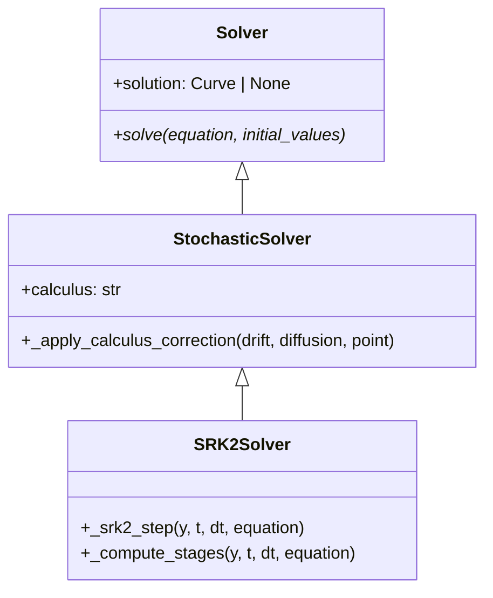
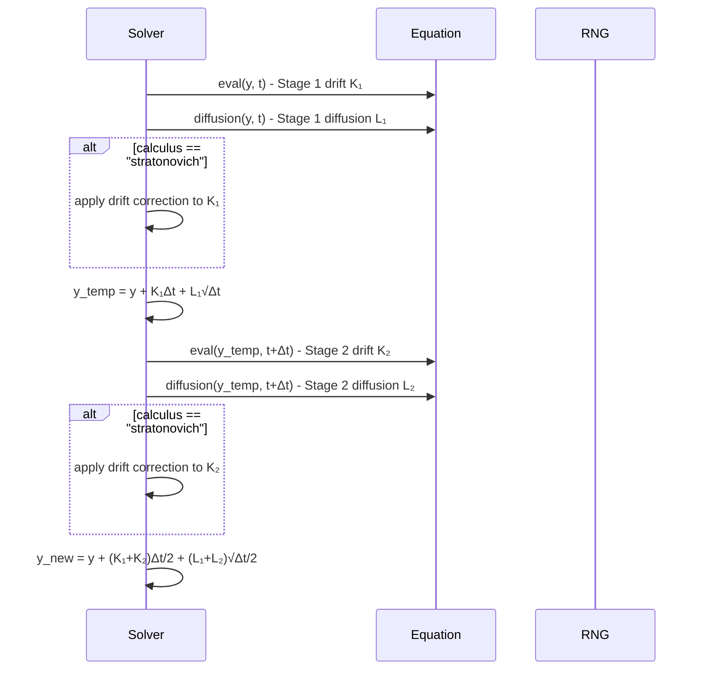

# SRK2

## Overview

SRK2 (Stochastic Runge-Kutta order 2) implements Platen's scheme for second-order stochastic Runge-Kutta methods. It provides higher accuracy than Euler-Maruyama through a 2-stage Runge-Kutta approach while maintaining reasonable computational cost.

## Architecture

```
SRK2Solver
├── Config: start_time, end_time, step_size, random_seed, calculus
├── Method: 2-stage stochastic Runge-Kutta (Platen's scheme)
├── Order: Strong 1.0, Weak 1.0
└── Calculus: Supports Ito and Stratonovich
```

## Executive Summary

**Purpose**: Higher-order stochastic integration with improved accuracy
**Key Features**: 2-stage Runge-Kutta, stochastic increments, calculus support
**Performance**: Better accuracy than Euler-Maruyama, moderate computational cost
**Use Cases**: Accurate SDE simulation, financial modeling, scientific computing

## Core Classes

### SRK2Config

```python
class SRK2Config(SolverConfig):
    """Configuration for SRK2 method."""

    start_time: float = 0.0
    end_time: float = 1.0
    step_size: float = 0.01
    random_seed: int | None = None
    calculus: Literal["ito", "stratonovich"] = "ito"
```

### SRK2Solver

```python
class SRK2Solver(Solver):
    """SRK2 method using Platen's 2-stage scheme."""

    def solve(self, equation: DifferentialEquation, initial_values: list[float]):
        """Solve SDE using SRK2 method."""

    def _srk2_step(self, y, t, dt, equation):
        """Single SRK2 step with 2 stages."""
```

## UML Class Diagram



## Sequence Diagram - SRK2 Step



## Folder Structure

```
srk2/
├── __init__.py
├── srk2_config.py
├── srk2_solver.py
└── SRK2.md
```

## Examples

### Geometric Brownian Motion

```python
from discrecontinual_equations.solver.stochastic.srk2 import SRK2Config, SRK2Solver

# dX = μX dt + σX dW
class GBM(StochasticFunction):
    def eval(self, point, time=None):
        x = point[0]
        return [0.08 * x]  # 8% drift

    def diffusion(self, point, time=None):
        x = point[0]
        return [0.25 * x]  # 25% volatility

config = SRK2Config(
    start_time=0, end_time=1, step_size=0.01,
    calculus="ito", random_seed=42
)

solver = SRK2Solver(config)
solver.solve(equation, [100.0])  # Start at $100
```

### Stochastic Lorenz System

```python
# 3D stochastic Lorenz with noise in Z equation
class StochasticLorenz(StochasticFunction):
    def eval(self, point, time=None):
        x, y, z = point
        sigma, rho, beta = 10, 28, 8/3
        return [
            sigma * (y - x),           # dx/dt
            x * (rho - z) - y,         # dy/dt
            x * y - beta * z           # dz/dt
        ]

    def diffusion(self, point, time=None):
        return [0, 0, 0.1]  # Noise only in Z

config = SRK2Config(
    start_time=0, end_time=50, step_size=0.001,
    calculus="stratonovich", random_seed=123
)

solver = SRK2Solver(config)
solver.solve(equation, [1.0, 1.0, 1.0])
```

## Functionality Explanation

### Mathematical Foundation

SRK2 implements Platen's scheme for stochastic Runge-Kutta methods:

**Stage 1:**
```
K₁ = μ(X_n, t_n)
L₁ = σ(X_n, t_n)
```

**Stage 2:**
```
K₂ = μ(X_n + K₁Δt + L₁√Δt, t_n + Δt)
L₂ = σ(X_n + K₁Δt + L₁√Δt, t_n + Δt)
```

**Final Update:**
```
X_{n+1} = X_n + (K₁ + K₂)Δt/2 + (L₁ + L₂)√Δt/2
```

### Ito vs Stratonovich Calculus

For Stratonovich interpretation, drift terms are corrected:
```
K_corrected = K - (1/2)σ ∂σ/∂x
```

This converts the Ito SRK2 to Stratonovich SRK2.

### Stability and Accuracy

- **Strong order 1.0**: Better path-wise accuracy than Euler-Maruyama
- **Weak order 1.0**: Same expected value accuracy as Euler-Maruyama
- **A-stable**: Good stability properties for many problems

## Algorithm Details

### Stage Computation

```python
def _srk2_step(self, y, t, dt, equation):
    # Stage 1
    K1 = np.array(equation.derivative.eval(y, t))
    L1 = np.array(equation.derivative.diffusion(y, t))

    if self.calculus == "stratonovich":
        K1 = self._apply_stratonovich_correction(K1, L1, y, t, equation)

    # Stage 2
    y_temp = y + K1 * dt + L1 * np.sqrt(dt)
    K2 = np.array(equation.derivative.eval(y_temp, t + dt))
    L2 = np.array(equation.derivative.diffusion(y_temp, t + dt))

    if self.calculus == "stratonovich":
        K2 = self._apply_stratonovich_correction(K2, L2, y_temp, t + dt, equation)

    # SRK2 combination
    y_new = y + (K1 + K2) * dt / 2 + (L1 + L2) * np.sqrt(dt) / 2
    return y_new
```

### Stratonovich Correction

```python
def _apply_stratonovich_correction(self, K, L, y, t, equation, eps=1e-8):
    """Apply Stratonovich drift correction."""
    # Compute ∂σ/∂x using finite differences
    L_plus = np.array(equation.derivative.diffusion(y + eps, t))
    L_minus = np.array(equation.derivative.diffusion(y - eps, t))
    dL_dx = (L_plus - L_minus) / (2 * eps)

    # Apply correction: K_corrected = K - (1/2)L * dL_dx
    return K - 0.5 * L * dL_dx
```

## Convergence Analysis

### Strong Convergence
- **Order 1.0**: `E[|X(t) - X̂(t)|] = O(Δt)`
- **Improvement**: Factor of √Δt better than Euler-Maruyama

### Weak Convergence
- **Order 1.0**: `|E[f(X(t))] - E[f(X̂(t))]| = O(Δt)`
- **Same as Euler-Maruyama** for expected values

### Computational Complexity
- **Per step**: 4 function evaluations (2 eval + 2 diffusion)
- **Memory**: O(dimension) additional storage
- **Total cost**: O(N × d) for N steps, d dimensions

## Performance Characteristics

| Method | Strong Order | Function Calls/Step | Relative Speed |
|--------|-------------|-------------------|----------------|
| Euler-Maruyama | 0.5 | 2 | Fastest |
| Milstein | 1.0 | 2 + derivatives | Medium |
| SRK2 | 1.0 | 4 | Medium-Slow |
| Higher SRK | 1.5+ | 6+ | Slow |

## Error Analysis

### Local Truncation Error
- **Deterministic part**: O(Δt³)
- **Stochastic part**: O(Δt^{5/2})
- **Combined**: O(Δt^{3/2})

### Implementation Considerations
- **Numerical differentiation** for Stratonovich correction
- **Multi-dimensional support** with component-wise corrections
- **Adaptive step sizing** possible but not implemented

## Applications

### Financial Engineering
- **Option pricing**: More accurate Black-Scholes paths
- **Risk management**: Better VaR calculations
- **Portfolio optimization**: Improved stochastic simulations

### Scientific Computing
- **Population models**: Logistic growth with demographic noise
- **Chemical kinetics**: Stochastic reaction rates
- **Climate models**: Atmospheric noise processes

### Engineering Systems
- **Control systems**: Stochastic feedback loops
- **Signal processing**: Noise reduction algorithms
- **Communications**: Channel modeling with noise

## References

- Platen, E. (1991). "An introduction to numerical methods for stochastic differential equations"
- Rößler, A. (2006). "Runge-Kutta methods for the numerical solution of stochastic differential equations"
- Burrage, K. & Burrage, P.M. (1996). "High strong order methods for non-commutative stochastic ordinary differential equations"

---

**Parent Module:** [STOCHASTIC](../STOCHASTIC.md)

**Related Modules:**
- [EULER_MARUYAMA](../euler_maruyama/EULER_MARUYAMA.md) - Basic stochastic method
- [MILSTEIN](../milstein/MILSTEIN.md) - Alternative order 1.0 method
