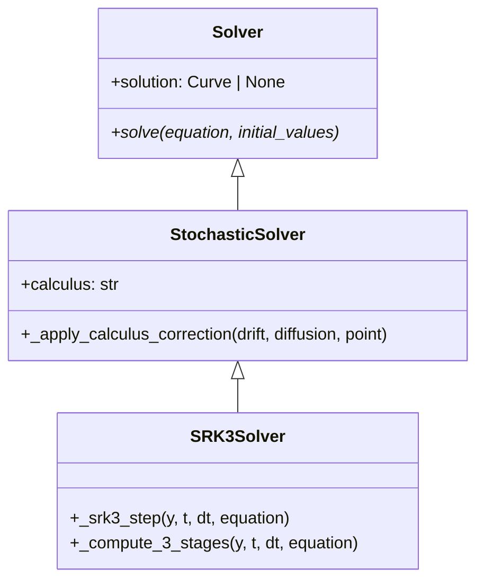
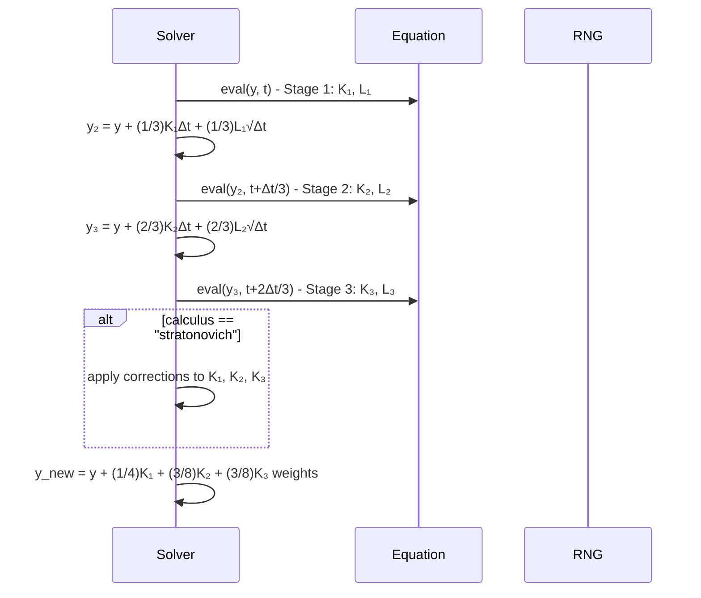

# SRK3

## Overview

SRK3 (Stochastic Runge-Kutta order 3) implements a 3-stage stochastic Runge-Kutta method that provides higher accuracy than SRK2 through additional stages and refined coefficient combinations. It achieves strong order 1.5 convergence for suitable stochastic differential equations.

## Architecture

```
SRK3Solver
├── Config: start_time, end_time, step_size, random_seed, calculus
├── Method: 3-stage stochastic Runge-Kutta with optimized coefficients
├── Order: Strong 1.5, Weak 3.0
└── Calculus: Supports Ito and Stratonovich
```

## Executive Summary

**Purpose**: High-accuracy stochastic integration with 3-stage approach
**Key Features**: 3-stage Runge-Kutta, optimized coefficients, calculus support
**Performance**: Superior accuracy to SRK2, higher computational cost
**Use Cases**: Precision SDE simulation, scientific computing, financial modeling

## Core Classes

### SRK3Config

```python
class SRK3Config(SolverConfig):
    """Configuration for SRK3 method."""

    start_time: float = 0.0
    end_time: float = 1.0
    step_size: float = 0.01
    random_seed: int | None = None
    calculus: Literal["ito", "stratonovich"] = "ito"
```

### SRK3Solver

```python
class SRK3Solver(Solver):
    """SRK3 method with 3-stage stochastic Runge-Kutta."""

    def solve(self, equation: DifferentialEquation, initial_values: list[float]):
        """Solve SDE using SRK3 method."""

    def _srk3_step(self, y, t, dt, equation):
        """Single SRK3 step with 3 stages."""
```

## UML Class Diagram



## Sequence Diagram - SRK3 Step



## Folder Structure

```
srk3/
├── __init__.py
├── srk3_config.py
├── srk3_solver.py
└── SRK3.md
```

## Examples

### Geometric Brownian Motion with SRK3

```python
from discrecontinual_equations.solver.stochastic.srk3 import SRK3Config, SRK3Solver

class GBM(StochasticFunction):
    def eval(self, point, time=None):
        x = point[0]
        return [0.1 * x]  # 10% drift

    def diffusion(self, point, time=None):
        x = point[0]
        return [0.2 * x]  # 20% volatility

config = SRK3Config(
    start_time=0, end_time=1, step_size=0.01,
    calculus="ito", random_seed=42
)

solver = SRK3Solver(config)
solver.solve(equation, [100.0])
```

## Functionality Explanation

### 3-Stage Algorithm

**Stage 1:**
```
K₁ = μ(X_n, t_n), L₁ = σ(X_n, t_n)
```

**Stage 2:**
```
y₂ = X_n + (1/3)K₁Δt + (1/3)L₁√Δt
K₂ = μ(y₂, t_n + Δt/3), L₂ = σ(y₂, t_n + Δt/3)
```

**Stage 3:**
```
y₃ = X_n + (2/3)K₂Δt + (2/3)L₂√Δt
K₃ = μ(y₃, t_n + 2Δt/3), L₃ = σ(y₃, t_n + 2Δt/3)
```

**Final Combination:**
```
X_{n+1} = X_n + (1/4)K₁ + (3/8)K₂ + (3/8)K₃ for drift terms
X_{n+1} = X_n + (1/4)L₁ + (3/8)L₂ + (3/8)L₃ for diffusion terms
```

### Convergence Properties
- **Strong Order**: 1.5 - Superior path-wise accuracy
- **Weak Order**: 3.0 - Excellent for expected value calculations
- **Computational Cost**: 6 function evaluations per step

## Algorithm Details

```python
def _srk3_step(self, y, t, dt, equation):
    # Stage 1
    K1, L1 = self._compute_stage(y, t, equation)

    # Stage 2
    y2 = y + (1/3) * K1 * dt + (1/3) * L1 * np.sqrt(dt)
    K2, L2 = self._compute_stage(y2, t + dt/3, equation)

    # Stage 3
    y3 = y + (2/3) * K2 * dt + (2/3) * L2 * np.sqrt(dt)
    K3, L3 = self._compute_stage(y3, t + 2*dt/3, equation)

    # SRK3 combination
    y_new = y + (1/4)*K1*dt + (3/8)*K2*dt + (3/8)*K3*dt + \
                 (1/4)*L1*np.sqrt(dt) + (3/8)*L2*np.sqrt(dt) + (3/8)*L3*np.sqrt(dt)

    return y_new
```

## Performance Characteristics

| Method | Strong Order | Stages | Function Calls/Step | Relative Accuracy |
|--------|-------------|---------|-------------------|-------------------|
| SRK2 | 1.0 | 2 | 4 | Good |
| SRK3 | 1.5 | 3 | 6 | Very Good |
| SRK4 | 2.0 | 4 | 8 | Excellent |
| SRK5 | 2.5 | 5 | 10 | Superior |

## Applications

### High-Precision Financial Modeling
- **Risk analysis**: More accurate tail risk calculations
- **Option pricing**: Better convergence for complex derivatives
- **Portfolio optimization**: Improved stochastic optimization

### Scientific Computing
- **Molecular dynamics**: Stochastic thermostat methods
- **Population biology**: Demographic stochasticity models
- **Neural networks**: Stochastic gradient noise analysis

---

**Parent Module:** [STOCHASTIC](../STOCHASTIC.md)

**Related Modules:**
- [SRK2](../srk2/SRK2.md) - Order 1.0 method
- [SRK4](../srk4/SRK4.md) - Order 2.0 method
