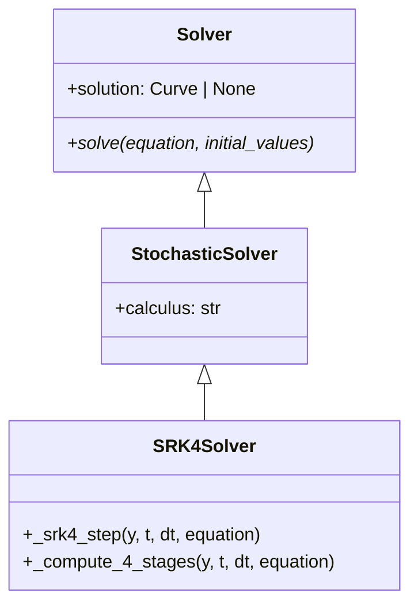
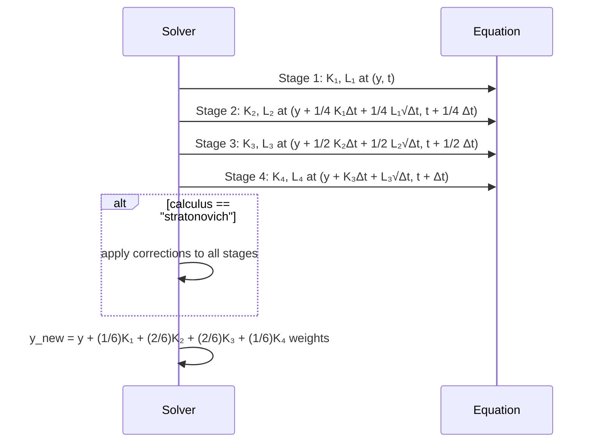

# SRK4

## Overview

SRK4 (Stochastic Runge-Kutta order 4) implements a 4-stage stochastic Runge-Kutta method that achieves strong order 2.0 convergence. It provides excellent accuracy for stochastic differential equations through sophisticated stage combinations and optimized coefficients.

## Architecture

```
SRK4Solver
├── Config: start_time, end_time, step_size, random_seed, calculus
├── Method: 4-stage stochastic Runge-Kutta with high-order coefficients
├── Order: Strong 2.0, Weak 4.0
└── Calculus: Supports Ito and Stratonovich
```

## Executive Summary

**Purpose**: Maximum accuracy stochastic integration for demanding applications
**Key Features**: 4-stage Runge-Kutta, optimal coefficients, calculus support
**Performance**: Highest accuracy among implemented methods, computational cost
**Use Cases**: Precision financial modeling, scientific research, engineering

## Core Classes

### SRK4Config

```python
class SRK4Config(SolverConfig):
    """Configuration for SRK4 method."""

    start_time: float = 0.0
    end_time: float = 1.0
    step_size: float = 0.01
    random_seed: int | None = None
    calculus: Literal["ito", "stratonovich"] = "ito"
```

### SRK4Solver

```python
class SRK4Solver(Solver):
    """SRK4 method with 4-stage stochastic Runge-Kutta."""

    def solve(self, equation: DifferentialEquation, initial_values: list[float]):
        """Solve SDE using SRK4 method."""

    def _srk4_step(self, y, t, dt, equation):
        """Single SRK4 step with 4 stages."""
```

## UML Class Diagram



## Sequence Diagram - SRK4 Step



## Folder Structure

```
srk4/
├── __init__.py
├── srk4_config.py
├── srk4_solver.py
└── SRK4.md
```

## Examples

### High-Precision GBM

```python
from discrecontinual_equations.solver.stochastic.srk4 import SRK4Config, SRK4Solver

class GBM(StochasticFunction):
    def eval(self, point, time=None):
        x = point[0]
        return [0.05 * x]

    def diffusion(self, point, time=None):
        x = point[0]
        return [0.15 * x]

config = SRK4Config(
    start_time=0, end_time=1, step_size=0.005,
    calculus="stratonovich", random_seed=42
)

solver = SRK4Solver(config)
solver.solve(equation, [100.0])
```

## Functionality Explanation

### 4-Stage Algorithm

**Stages:**
```
K₁ = μ(X_n, t_n), L₁ = σ(X_n, t_n)
K₂ = μ(X_n + 1/4 K₁Δt + 1/4 L₁√Δt, t_n + 1/4 Δt)
K₃ = μ(X_n + 1/2 K₂Δt + 1/2 L₂√Δt, t_n + 1/2 Δt)
K₄ = μ(X_n + K₃Δt + L₃√Δt, t_n + Δt)
```

**Final Combination:**
```
X_{n+1} = X_n + (1/6)K₁Δt + (2/6)K₂Δt + (2/6)K₃Δt + (1/6)K₄Δt
X_{n+1} = X_n + (1/6)L₁√Δt + (2/6)L₂√Δt + (2/6)L₃√Δt + (1/6)L₄√Δt
```

### Convergence Properties
- **Strong Order**: 2.0 - Excellent path-wise accuracy
- **Weak Order**: 4.0 - Superior for expected value calculations
- **Computational Cost**: 8 function evaluations per step

## Algorithm Details

```python
def _srk4_step(self, y, t, dt, equation):
    # Stage 1
    K1, L1 = self._compute_stage(y, t, equation)

    # Stage 2
    y2 = y + (1/4) * K1 * dt + (1/4) * L1 * np.sqrt(dt)
    K2, L2 = self._compute_stage(y2, t + dt/4, equation)

    # Stage 3
    y3 = y + (1/2) * K2 * dt + (1/2) * L2 * np.sqrt(dt)
    K3, L3 = self._compute_stage(y3, t + dt/2, equation)

    # Stage 4
    y4 = y + K3 * dt + L3 * np.sqrt(dt)
    K4, L4 = self._compute_stage(y4, t + dt, equation)

    # SRK4 combination
    y_new = y + (1/6)*K1*dt + (2/6)*K2*dt + (2/6)*K3*dt + (1/6)*K4*dt + \
                 (1/6)*L1*np.sqrt(dt) + (2/6)*L2*np.sqrt(dt) + (2/6)*L3*np.sqrt(dt) + (1/6)*L4*np.sqrt(dt)

    return y_new
```

## Performance Characteristics

| Method | Strong Order | Stages | Function Calls | Accuracy Level |
|--------|-------------|---------|----------------|----------------|
| SRK2 | 1.0 | 2 | 4 | Good |
| SRK3 | 1.5 | 3 | 6 | Very Good |
| SRK4 | 2.0 | 4 | 8 | Excellent |
| SRK5 | 2.5 | 5 | 10 | Superior |

## Applications

### Advanced Financial Engineering
- **Complex derivatives**: Better convergence for exotic options
- **Risk management**: Precise Value-at-Risk calculations
- **High-frequency trading**: Accurate stochastic volatility models

### Research Applications
- **Quantum systems**: Stochastic Schrödinger equations
- **Climate modeling**: Stochastic weather prediction
- **Population dynamics**: Advanced demographic models

---

**Parent Module:** [STOCHASTIC](../STOCHASTIC.md)

**Related Modules:**
- [SRK3](../srk3/SRK3.md) - Order 1.5 method
- [SRK5](../srk5/SRK5.md) - Order 2.5 method
