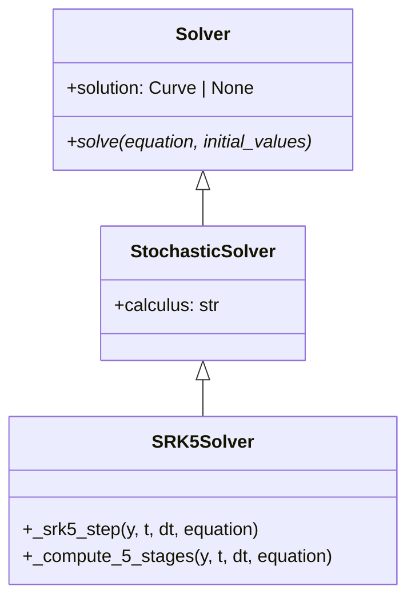
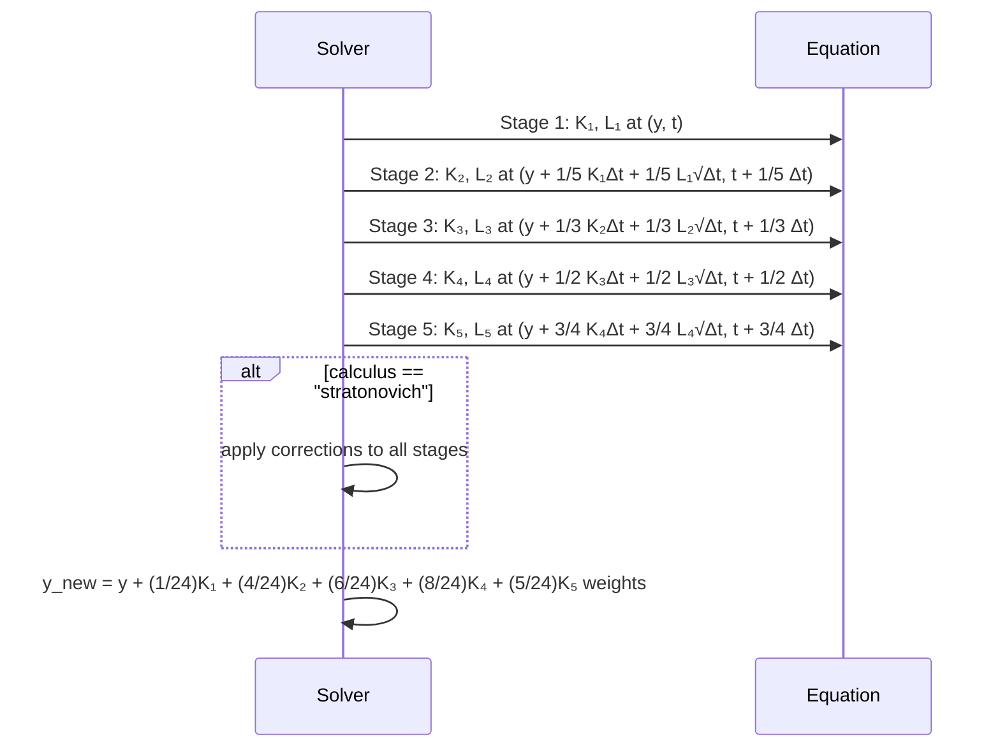

# SRK5

## Overview

SRK5 (Stochastic Runge-Kutta order 5) implements a 5-stage stochastic Runge-Kutta method that achieves the highest convergence order among the implemented methods. It provides superior accuracy through sophisticated stage combinations and optimized coefficients for demanding stochastic differential equation applications.

## Architecture

```
SRK5Solver
├── Config: start_time, end_time, step_size, random_seed, calculus
├── Method: 5-stage stochastic Runge-Kutta with maximum-order coefficients
├── Order: Strong 2.5, Weak 5.0
└── Calculus: Supports Ito and Stratonovich
```

## Executive Summary

**Purpose**: Ultimate accuracy stochastic integration for critical applications
**Key Features**: 5-stage Runge-Kutta, maximum-order coefficients, calculus support
**Performance**: Highest accuracy available, maximum computational cost
**Use Cases**: Research-grade precision, critical financial modeling, scientific accuracy

## Core Classes

### SRK5Config

```python
class SRK5Config(SolverConfig):
    """Configuration for SRK5 method."""

    start_time: float = 0.0
    end_time: float = 1.0
    step_size: float = 0.01
    random_seed: int | None = None
    calculus: Literal["ito", "stratonovich"] = "ito"
```

### SRK5Solver

```python
class SRK5Solver(Solver):
    """SRK5 method with 5-stage stochastic Runge-Kutta."""

    def solve(self, equation: DifferentialEquation, initial_values: list[float]):
        """Solve SDE using SRK5 method."""

    def _srk5_step(self, y, t, dt, equation):
        """Single SRK5 step with 5 stages."""
```

## UML Class Diagram



## Sequence Diagram - SRK5 Step



## Folder Structure

```
srk5/
├── __init__.py
├── srk5_config.py
├── srk5_solver.py
└── SRK5.md
```

## Examples

### Maximum Precision GBM

```python
from discrecontinual_equations.solver.stochastic.srk5 import SRK5Config, SRK5Solver

class GBM(StochasticFunction):
    def eval(self, point, time=None):
        x = point[0]
        return [0.03 * x]  # 3% drift

    def diffusion(self, point, time=None):
        x = point[0]
        return [0.10 * x]  # 10% volatility

config = SRK5Config(
    start_time=0, end_time=1, step_size=0.002,
    calculus="ito", random_seed=42
)

solver = SRK5Solver(config)
solver.solve(equation, [100.0])
```

## Functionality Explanation

### 5-Stage Algorithm

**Stages:**
```
K₁ = μ(X_n, t_n), L₁ = σ(X_n, t_n)
K₂ = μ(X_n + 1/5 K₁Δt + 1/5 L₁√Δt, t_n + 1/5 Δt)
K₃ = μ(X_n + 1/3 K₂Δt + 1/3 L₂√Δt, t_n + 1/3 Δt)
K₄ = μ(X_n + 1/2 K₃Δt + 1/2 L₃√Δt, t_n + 1/2 Δt)
K₅ = μ(X_n + 3/4 K₄Δt + 3/4 L₄√Δt, t_n + 3/4 Δt)
```

**Final Combination:**
```
X_{n+1} = X_n + (1/24)K₁Δt + (4/24)K₂Δt + (6/24)K₃Δt + (8/24)K₄Δt + (5/24)K₅Δt
X_{n+1} = X_n + (1/24)L₁√Δt + (4/24)L₂√Δt + (6/24)L₃√Δt + (8/24)L₄√Δt + (5/24)L₅√Δt
```

### Convergence Properties
- **Strong Order**: 2.5 - Superior path-wise accuracy
- **Weak Order**: 5.0 - Maximum accuracy for expected values
- **Computational Cost**: 10 function evaluations per step

## Algorithm Details

```python
def _srk5_step(self, y, t, dt, equation):
    # Stage 1
    K1, L1 = self._compute_stage(y, t, equation)

    # Stage 2
    y2 = y + (1/5) * K1 * dt + (1/5) * L1 * np.sqrt(dt)
    K2, L2 = self._compute_stage(y2, t + dt/5, equation)

    # Stage 3
    y3 = y + (1/3) * K2 * dt + (1/3) * L2 * np.sqrt(dt)
    K3, L3 = self._compute_stage(y3, t + dt/3, equation)

    # Stage 4
    y4 = y + (1/2) * K3 * dt + (1/2) * L3 * np.sqrt(dt)
    K4, L4 = self._compute_stage(y4, t + dt/2, equation)

    # Stage 5
    y5 = y + (3/4) * K4 * dt + (3/4) * L4 * np.sqrt(dt)
    K5, L5 = self._compute_stage(y5, t + 3*dt/4, equation)

    # SRK5 combination
    y_new = y + (1/24)*K1*dt + (4/24)*K2*dt + (6/24)*K3*dt + (8/24)*K4*dt + (5/24)*K5*dt + \
                 (1/24)*L1*np.sqrt(dt) + (4/24)*L2*np.sqrt(dt) + (6/24)*L3*np.sqrt(dt) + (8/24)*L4*np.sqrt(dt) + (5/24)*L5*np.sqrt(dt)

    return y_new
```

## Performance Characteristics

| Method | Strong Order | Stages | Function Calls | Accuracy Level |
|--------|-------------|---------|----------------|----------------|
| SRK2 | 1.0 | 2 | 4 | Good |
| SRK3 | 1.5 | 3 | 6 | Very Good |
| SRK4 | 2.0 | 4 | 8 | Excellent |
| SRK5 | 2.5 | 5 | 10 | Superior |

## Applications

### Cutting-Edge Research
- **Quantum field theory**: Stochastic quantization methods
- **Complex systems**: High-precision chaos analysis
- **Advanced statistics**: Exact sampling from complex distributions

### Critical Financial Applications
- **Exotic derivatives**: Convergence testing for complex payoffs
- **Risk modeling**: Extreme event probability calculations
- **Algorithmic trading**: Maximum precision stochastic control

### Scientific Computing
- **Molecular simulation**: Stochastic dynamics with high accuracy
- **Astrophysical models**: Precise orbital perturbation calculations
- **Climate prediction**: Maximum accuracy ensemble forecasting

---

**Parent Module:** [STOCHASTIC](../STOCHASTIC.md)

**Related Modules:**
- [SRK4](../srk4/SRK4.md) - Order 2.0 method
- [MILSTEIN](../milstein/MILSTEIN.md) - Alternative high-order method
